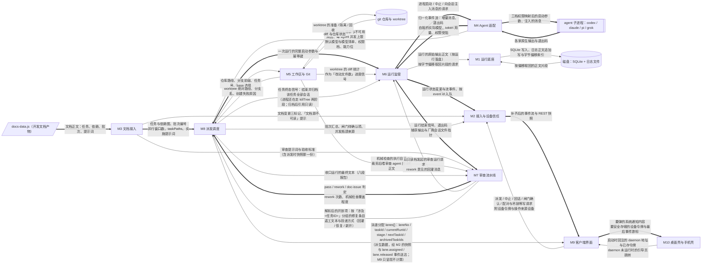

# 系统架构与模块划分

## 一句话架构

**一个常驻服务（daemon）+ 两个只做壳的客户端。**

daemon 跑在装着 agent 的那台 Windows、macOS 或 Linux 电脑上，是真正干活的那个；
桌面端与手机端**共用同一套 Web UI**，由 daemon 静态托管同一份产物，
分别套在 Tauri v2 与 Capacitor 壳里。壳只负责窗口、系统通知、令牌存储三件事。

这个形状是三条约束交汇的结果：agent 只能装在本机（物理约束）、
提醒要在人离开电脑后照常送达（决策 1）、不自建任何服务器（决策 2）。

## 模块表

**依赖无环，M1 是唯一叶子。** 依赖列写「谁依赖谁」，箭头指向被依赖方。

| 模块 | 职责 | 依赖 |
|---|---|---|
| M1 | **运行底座**——让 daemon 在这台机器上稳定跑起来并把字节落到磁盘上：进程单实例与端口、启动自检、开机自启注册、数据目录、结构化存储的连接与迁移、日志正文的追加写与字节偏移索引、以及全部平台差异（进程树终止、路径规范化与长路径、配置目录、子进程编码）的唯一收口。凡与操作系统、磁盘、进程存活打交道而不带任何业务概念的都归它 | — |
| M2 | **接入与设备信任**——定义两端如何连上 daemon 并不丢事件地保持同步：一次性配对码与可单独吊销的设备令牌、鉴权与操作归属、REST 骨架与 API 版本、SSE 服务端的事件信封／重放窗口／保活，以及自写的 SSE 客户端。凡「谁能连上、连上之后按什么协议收发」的都归它 | M1 |
| M3 | **文档接入**——把 `docs-data.js` 变成本产品唯一的任务真相源（任务、依赖、批次、并行窗口、验收标准、边界编号、实施与审查两段提示词），并负责内容指纹、派发时快照与文档重出后的三个标记；收口提示词 `dispatchBatches` 的按任务集合匹配也归它。凡「这条数据来自文档」的都归它 | M1, M2 |
| M4 | **Agent 适配**——把形态各异的 agent 抽象成同一个可派发对象：注册表（含每个 agent 通用的版本指纹探测字段与具名的「适配器种类」枚举）、可执行探测、模型清单读取与降级、启动参数与三档权限映射、以各家原生通道为主干把输出归一化成 ACP `session/update` 词汇的事件、可回话与**是否提供流式事件**等能力位，并自实现一个通用 ACP 适配器作为兜底与第 6 家及以后的入口。凡「某一家 agent 跟别家怎么不一样」的都归它；登录态探测（三值、只跑 agent 自己的状态命令、结果缓存）与模型清单的四级来源合并（实时／配置／内置别名／历史）也归它——它们都是「这一家怎么问」的事 | M1 |
| M5 | **工作区与 Git**——为每个任务准备、隔离与回收独立 worktree，从中读出改动（改动文件数、diff stat、diff 正文）并生成只读落地清单。凡要碰 git 或任务工作目录的都归它 | M1 |
| M6 | **运行监管**——管一次运行从启动到结束的全过程：状态机（「已退出」与「已落地」分开）、收流与落盘编排、按游标分段回读与厂商会话文件的只读引用、进度信号、停滞检测、中止与 daemon 重启后的对账、回话投递；任务到达终态后结束并归档该任务全部会话（进程还在走 `killTree` 两阶段），归档后会话引用只读、不得复用，也归它。凡「这一次运行现在怎么样、它说过什么」的都归它 | M1, M2, M4, M5 |
| M7 | **审查流水线**——对已结束的运行做「合不合格」的判定：先跑本地机械检查，通过后以只读档派一个 agent 跑文档给出的审查提示词，产出 pass / rework / doc-issue 并回灌 rework 意见；从审查输出提取返工文本、按能力位选回灌／恢复／新开返工运行，以及解析收口运行的八段报告，也归它；第 N+1 轮审查续接同一审查会话、查 bug 阶段的运行与五段报告解析同样归它。凡「判定一次运行的结果」的都归它；审查、查 bug 阶段的运行用哪个 agent、模型与思考强度，一律读派发快照里的任务指派（审查可被 pipeline 设置的「审查覆盖」替换），不自己取 agent 默认 | M1, M3, M5, M6 |
| M8 | **派发调度**——决定什么时候把哪个任务、用哪个 agent 与哪个模型、以什么权限派出去，并按批次、并行窗口、每 agent 并发与路径冲突限流，在三个闸门处停或放行、失败或重派时重新入队；判定本批分支是否都进了 HEAD、触发收口运行、按收口报告派修复运行与管理收口轮次也归它；泳道（窗口槽位）分配、任务终态后的补位、查 bug 与收口模式两个开关的持久化同样归它——泳道分配是它算出的派生数据。凡涉及顺序、名额、放行、重派的都归它；任务指派写进派发快照、阶段取值链（任务指派 → 阶段覆盖 → agent 默认）与收口指派设置也归它——它是唯一决定「这一阶段用谁跑」的地方，M7 只消费结果 | M1, M2, M3, M4, M5, M6, M7 |
| M9 | **客户端界面**——两端共用的那一套界面本身：多流监看、会话查看、审批与闸门、设置与配对、落地清单、按批次折叠的批次树与执行行呼吸灯、按窗口数呈现的任务流水线泳道与「会话已归档」历史行、顶栏两个流水线开关，以及同一套代码的窄屏降级。它只通过 M2 的契约与 daemon 通信，**界面里不含任何业务判定**（折叠默认值、「能否收口」、泳道分配、阶段推进与会话归档都是 daemon 给的字段）；指派面板的分组模型下拉、登录态徽标与刷新按钮、参照条的「来源」段同样只呈现 daemon 下发的字段，不算取值链 | M2 |
| M10 | **桌面壳与手机壳**——只做窗口与单实例、系统通知、令牌安全存储三件事的两个原生容器，外加 daemon 未运行时的引导、Windows/macOS/Linux 桌面构建与运行依赖检测。壳按界面声明的可选桥接接口去实现，界面在没有壳时按能力探测降级，因此依赖方向恒为壳→界面 | M1, M2, M9 |

**M8 依赖其余七个模块——这是编排者的正常形态，不是环。**
**M9 只依赖 M2 的契约**，使界面任务可与 daemon 侧并行开工。
M5 被 M6/M7/M8 三家依赖，按「公共部分单独成模块」保留为独立模块，
且**不反向依赖文档模块**（repo 路径与分支前缀由 M8 传参），以免多出一条无谓的边。

> 模块数为 10 且**硬性封顶**（决策 37）。要增设第 11 个必须重新裁决，
> 不得由实施者自行增设。
> M1 现有 9 个任务；「每模块至少 3 个任务」的机械规则仍保留。

## 数据流图

> ⚠️ 本图**未经 `diagram-generator` 技能生成**——该技能在本机不存在（见 24 节）。
> 图按其规格手绘：参与方使用文档里已存在的模块 ID，只画数据流动、不重复依赖关系。
> 阅读器内置的极简 mermaid 解析器只渲染 `sequenceDiagram` 与 `stateDiagram`，
> **本图会以源码形式显示**；在 Obsidian 里可正常渲染。



**怎么读这张图。** 方框是模块，非方框是系统边界外的东西：
平行四边形是文档产物，双竖边是五个 agent 子进程，圆柱是 git 仓库与磁盘。
箭头上的文字**就是流动的数据本身**，不是调用关系。

**主干（粗箭头）**：`docs-data.js` → M3 → M8 → M6 → M4 → agent 子进程；
agent 的原生输出经 M4 归一化回流到 M6，M6 把结束信号交给 M7 审查，
M7 的判定回到 M8 决定下一步，同时 M6 的状态经 M2 一路推到 M9、再由 M9 交给 M10。

**细箭头是主干旁挂的供给与回写**：M5 供 worktree 与 diff，M1 管落盘与按偏移回读，
M4→M8 供 agent 能力数据，M9→M2 与 M10→M9 是两端的写请求与启动回注。

图中每一对反向箭头（M8↔M5、M6↔M4、M6↔M7、M8↔M7、M9↔M2、M9↔M10）
都是「发请求／收结果」的一来一回，**不是循环依赖**。
M8→M7 那条边是收口输出：收口运行由 M8 派出、由 M7 解析；
M7→M8 回来的是修复条目与返工文本，M8 据此派修复运行或返工运行。

补充需求 2026-09-12 加了两条接缝：**M8→M9 的泳道分配**——泳道（窗口槽位）由 M8 算成派生数据 `lanes[]`，
经 M2 的快照与 `lane.assigned` / `lane.released` 事件送到 M9，M9 只按 `laneNo` 排列、不算槽位也不算下一个任务
（模块表里 M9 仍只依赖 M2，这条边画的是数据从哪来）；**M8→M6 的任务终态归档**——任务落地或转人后 M8 通知 M6 结束并归档
该任务全部会话，进程还在就走 `killTree` 两阶段，归档后 `vendor_session_ref` 只读、绝不复用给下一个任务。

## 全项目共用约定

**凡是必须两侧一致的东西都在这里，不拆到 07/08。**
「统一错误处理」里的「统一」二字就是这一节存在的全部理由——分开写，两侧就会长成两套系统。

### 错误体系

错误码枚举**唯一定义**在 `packages/shared/src/errors/codes.ts`：

```ts
export const ERROR_CODES = {
  E_VALIDATION: { defaultHttpStatus: 400, retryable: false },
  // …
} as const;
export type ErrorCode = keyof typeof ERROR_CODES;
```

daemon 与 web 都从 shared import **同一份**，不许各自复制一份常量。分工写死：

- **只有 daemon 的 `http/plugins/90-error-handler.ts` 读 `defaultHttpStatus` 并转 HTTP 状态码**
- **只有 web 的 `src/i18n/error-messages.ts` 把 code 转中文用户文案**
  （键就是 code，缺键时回落显示原始 code 而不是空白）
- daemon 返回的 `message` 恒为**英文开发者短句**，结构化信息一律进 `details`
  （如 E-195 要展示的实测版本串与期望模式）
- **前端禁止按 HTTP 状态码分支**，一律按 `error.code` 分支——
  状态码只用来判「要不要重试 / 要不要重新配对」这两件粗事

与 10 节保持同源的机制是**单向校验**：`scripts/check-error-codes.mjs`
断言 `codes.ts` 的键集合与 10 节的错误码表逐行一致，不一致即 `pnpm -w check` 失败。
**方向是「文档为源、代码为投影」**——10 节的表是源，改错误码先改文档。

**禁令**：代码中出现未登记在 `codes.ts` 的 `E_` 字面量由 arch 测试判失败；
新增错误码必须同时补 `defaultHttpStatus` 与 web 的文案键；
**`E-01` 这类边界编号与 `E_VALIDATION` 这类错误码是两套东西，禁止互相引用或混写。**

### 环境变量

环境变量**只在 `packages/daemon/src/config/env.ts` 一处**声明与校验，
前缀恒为 `AGSCHED_`、全大写下划线，**全集就五个且穷举写死**：

| 变量 | 默认 | 说明 |
|---|---|---|
| `AGSCHED_PORT` | 7817 | 监听端口 |
| `AGSCHED_BIND` | `0.0.0.0` | 配合默认开启的强鉴权（E-08） |
| `AGSCHED_DATA_DIR` | 当前平台用户应用数据目录 | Windows/macOS/Linux 默认值见 04 与 18 节 |
| `AGSCHED_LOG_LEVEL` | `info` | 日志级别 |
| `AGSCHED_DEV` | 关 | **只控制「错误响应里带不带 stack」，明令不得影响鉴权、不得放宽任何校验** |

校验用手写 `parseEnv()` 返回 冻结的 `AppConfig`：缺失项可回落默认，
但**格式非法的值必须打印变量名与期望格式后退出**——`AGSCHED_PORT=abc`
不许静默回落 7817（语义与 E-139 的版本自检一致）。

**密钥面**：本产品自身不需要任何第三方密钥（04 节已确认）。
需要保护的只有设备令牌与配对码：

- 令牌在 daemon 侧**只存 `scrypt` 哈希 + 随机盐**（Node 内置 `crypto`，不引哈希库），
  **绝不存明文**，比对用 `timingSafeEqual`
- 配对码只活在内存，TTL ≤60 秒，一次性（E-07）
- 客户端侧令牌存壳的安全存储（Tauri / Capacitor Preferences），
  **禁止存进 localStorage**

仓库里**禁止出现任何 `.env` 或 `.env.example`**——产品配置只有五个变量，
示例文件必然漂移；默认值与说明写在 `config/defaults.ts` 的注释里。
`config/env.ts` 还会在 boot 时快照 `APPDATA` / `XDG_DATA_HOME` 两个操作系统宿主输入，
它们不属于产品配置，不能被写入 `.env`。数据目录由 platform 用注入的宿主输入解析为
本机绝对路径：Windows 为绝对 `APPDATA` 或 `homedir/AppData/Roaming`，macOS 为
`homedir/Library/Application Support`，Linux 为绝对 `XDG_DATA_HOME` 或
`homedir/.local/share`，再追加 `agent-scheduler`；不得把 `~`、`${...}` 或 `%...%`
字面量交给文件系统（E-271）。

**禁令**：业务代码禁止直读 `process.env`（唯二白名单是 `config/env.ts` 与 `proc/env.ts`）；
禁止直读 `process.platform`（唯一定点是 `platform/host.ts`）；
**禁止把令牌／配对码／`Authorization` 头写进任何日志或事件 payload**
（logger 的 `redact` 与事件构造处各挡一道）。

### 共用类型

请求响应类型集中在 `packages/shared/src/api/`，**按资源分文件且与端点表一一对应**
（`tasks.ts` / `runs.ts` / `agents.ts` / `batches.ts` / `devices.ts` / `events.ts` /
`documents.ts` / `gates.ts` / `settings.ts` / `snapshot.ts` / `pair.ts` / `system.ts` /
`routes.ts` / `shell/bridge-contract.ts`）。
**新增一类资源 = 新增一个同名文件，不得塞进现有文件**；
`package.json` 用 subpath `exports` 逐个映射（因为禁止 barrel），
**手写 TypeScript 接口，不引入 schema→类型的生成链**——
单人自用、五十来个端点，生成链的维护成本高于它省下的。

10 节的机器化载体是 `packages/shared/src/api/routes.ts` 里的一张常量表：

```ts
{ method, path, auth: 'device' | 'none', reqType, resType, errors: ErrorCode[] }
```

daemon 侧 `test/arch/routes.test.ts` 断言「Fastify 实际注册的 method+path 集合 === 该表」，
**多一条少一条都失败**；10 节文档由该表同一套 `scripts/gen-*.mjs` 渲染，
并在 `pnpm -w check` 中校验一致。

入参校验用 Fastify 内置 AJV，`schema.body/params/querystring` 的 JSON Schema
**手写在各自路由文件里**并与 shared 的 TS 类型同名对应；
**出参不写 schema**（关闭响应序列化校验，避免 SSE 与大对象的开销），响应正确性靠 TS 保证。

**数据库行类型与 API 类型严格分开**：repo 只收发 `XxxRow`（snake_case，字段名等于列名），
service 负责转成 shared 的 camelCase DTO。
**禁止把 Row 直接从 API 吐出去**——否则一次列改名就泄漏到手机端。

`packages/shared` 的 `package.json` 的 `dependencies` **必须为空**，
只导出类型、纯常量、纯函数，**禁止 import 任何运行时依赖**（arch 测试断言）。
daemon 与 web **禁止各自定义同名 DTO**，出现同名 exported interface 而非来自 shared 的一律判失败。

### 命名与格式

- 文件与目录一律 `kebab-case.ts`，**零例外**（含只导出一个类型的文件）；
  **禁止 barrel `index.ts`**
- 类型与接口 `PascalCase` 且**不加 `I` 前缀**；函数与变量 `camelCase`；
  工厂函数一律 `createXxx`；返回布尔的一律 `isXxx` / `hasXxx` / `canXxx`；
  常量对象 `SCREAMING_SNAKE_CASE` 且**必须 `as const`**
- **事件 kind 的两组命名形状是硬规则**：ACP 组保留原文 snake_case
  （`agent_message_chunk`、`tool_call`），本产品组 `〈scope〉.〈过去式〉`（`run.started`）。
  **不许为统一风格改写 ACP 原文。**
- 错误码 `E_` + SCREAMING_SNAKE_CASE；**边界编号 `E-数字` 只出现在文档与测试用例名里，不许当标识符**
- 数据库表名 `snake_case` 复数、列名 `snake_case`；
  时间列一律 `_at` 后缀并**存 ISO8601 文本**（不存 unix 秒，便于直接开库看）；
  布尔列存 `0/1` 且列名带 `is_` / `has_` 前缀
- lint 与 format 配置放**仓库根、单文件、不分包**（子包不得各带一份）；
  执行入口统一为根脚本 `pnpm -w check`（构成见下）

**强制点写实**：本项目没有 pre-push 钩子；本地强制点是
**19 节每个任务的验收命令里必须包含 `pnpm -w check`**。
三平台发布另由 Windows、macOS、Ubuntu CI 强制执行同一检查、平台集成与桌面壳构建，
任一平台失败都阻断发布（决策 57）。禁止 `--no-verify` 式绕过或临时关规则。

`pnpm -w check` 的构成写死为三段串联：
**`biome ci .`（只检查不改写）+ `tsc -b --noEmit` + `vitest run`**（含 arch 测试与
web 包的 `check-contrast.ts` / `check-forbidden.ts`）。任一失败即任务不予验收。

### 架构评审采纳的修订

下面四条由前端架构师在评审 `shared` 草案时提出（`CONFLICTS`），**经核对属实，已采纳**。
它们是对草案的补全，不是新的范围。

1. **错误码要分服务端与客户端两类。** 前端必然遇到三种根本没有 HTTP 响应的失败——
   网络不可达、请求超时、壳能力缺失。原草案下前端只能自造字面量码（违反「唯一定义」）
   或把网络失败伪装成某个业务码（用户看到的中文文案就会错）。
   **修订**：`codes.ts` 每个条目加 `origin: 'server' | 'client'` 字段，
   新增三条 client 码 `E_NETWORK` / `E_TIMEOUT` / `E_SHELL_UNAVAILABLE`
   （`defaultHttpStatus` 置 `null`，daemon 侧错误插件跳过 `origin === 'client'` 的条目）。
2. **401 / 403 必须走同一个响应信封，SSE 的 401 也要带 body。**
   鉴权失败通常发生在 Fastify 的 `onRequest` 钩子里、未必经过错误处理插件，
   SSE 的 401 更是在流体开始之前就返回。若不保证，前端只能退回按状态码分支——
   与「禁止按 HTTP 状态码分支」直接冲突。
   **修订**：鉴权与设备吊销路径（401/403）必须复用同一信封，
   并给出 `E_UNAUTHORIZED` / `E_DEVICE_REVOKED` 两个明确 code；SSE 握手失败同样返回带信封的 body。
3. **事件 kind 要在 shared 导出可穷尽检查的判别联合。**
   原草案只规定了两组命名形状，没规定类型形态。若 kind 只是 `string`，
   TS 的 switch 拿不到穷尽性检查，daemon 新增事件时前端会静默漏掉——
   那应该是 E-202 的显式兜底，不该是类型缺陷造成的。
   **修订**：`packages/shared/src/api/events.ts` 导出 `EVENT_KINDS` 常量对象（`as const`）
   与按 kind 收窄的 `EventEnvelope` 判别联合；两组命名形状不变。
   **全文档统一用这一个路径**——08 节与 19 节 M2-T4 里出现的 `shared/src/events.ts` 均以此为准。
4. **shared 需要一个纯类型的 `shared/src/shell/` 目录。**
   壳桥接契约 `ShellBridge` 同时被 web、shell-desktop、shell-mobile 三个包实现与消费，
   放在 web 里会导致两个壳 import web 包。
   **修订**：明确允许 `packages/shared/src/shell/bridge-contract.ts`
   （仍是纯类型，`dependencies` 保持为空），并把「壳能力只有三件」
   写进该文件的类型定义里作为**编译期约束**。
