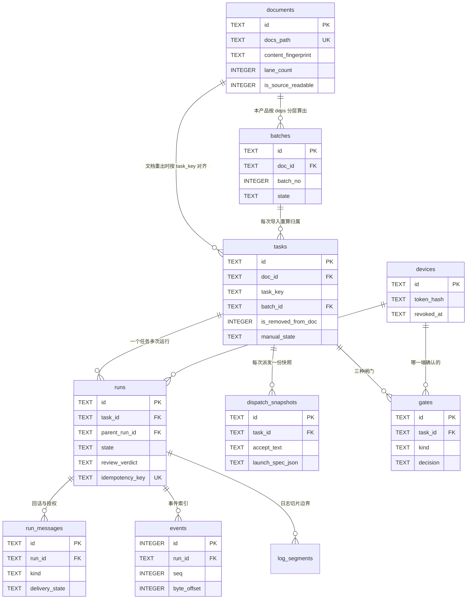
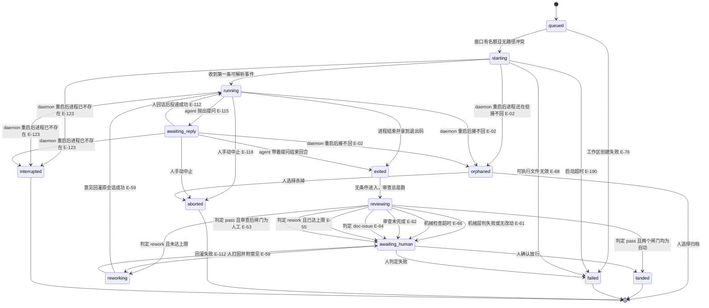

# 数据模型

存储分两处，**分工是硬约束**（见 08 节）：
**SQLite 只存结构化与可筛选字段，日志正文只存文件**，库里任何列都不得存事件 payload 正文。

数据目录默认 `%APPDATA%\agent-scheduler\`：

```
%APPDATA%\agent-scheduler\
├── daemon.json          进程配置（端口/绑定/日志级别），启动读一次
├── agents.json          agent 注册表，热加载
├── app.db               SQLite 主库（WAL）
└── runs\〈runId〉\
    ├── raw.log          stdout/stderr 交错的原始行
    └── events.ndjson    每行一个归一化事件信封（全量原文，永不截断）
```

## 实体一览

| 实体 | 说明 | 主键 |
|---|---|---|
| `documents` | 接入的每一份开发文档 | `id` |
| `tasks` | 从文档读入的任务，随文档重新导入而更新 | `id` |
| `batches` | **本产品按 `tasks[].deps` 拓扑分层算出的批次**（分层规则与阅读器一致，见下） | `id` |
| `runs` | 一个任务的一次执行（实施或审查） | `id` |
| `dispatch_snapshots` | 派发那一刻的三段快照与启动载荷 | `id` |
| `gates` | 闸门的待确认与已决记录 | `id` |
| `run_messages` | 回话与授权消息，含未送达记录 | `id` |
| `events` | 事件**索引**（只收里程碑事件，不存正文） | `id` |
| `log_segments` | 日志文件的切片边界 | `id` |
| `devices` | 已配对设备 | `id` |
| `event_seq` | 事件 id 的水位表 | `name` |
| `schema_migrations` | 迁移记录 | `version` |

> **agent 注册表不是表**——它是 `agents.json` 文件（决策 15 的数据层），支持热加载。
> 派发时把条目**逐字段深拷贝**进 `dispatch_snapshots.launch_spec_json`，
> 在途运行只读快照（E-93）。

## 批次是本产品算的，不是文档给的

**这一条纠正了一个曾经的错误前提**（决策 48）。上游 `docs-data.js` 的 payload
只有 `project` / `generated` / `review` / `groups` / `data` / `pres` / `index` 七个键，
**没有 batch 字段，也没有 laneCount**——交接台里的「第 N 批」是阅读器的 JS
在浏览器里现算的，并行窗口数则先读浏览器 localStorage、读不到才用启发式。

因此：

- **批次由本产品自己推导**，但**分层规则与阅读器逐字一致**，使批次号天然对得上：
  **层号 = 最长前驱链长度，无前驱为 0，成环就地截断为 0，显示号 = 层号 + 1**。
  这是一个十来行的纯函数、不含任何运行时状态，实现收敛在决策 4 已定的**唯一适配器模块**内，
  并在注释里注明对应上游的 `layerOf`。
- **并行窗口数是本产品自己的设置**（默认 2，可调 1–6，按文档持久化在自己的库里）。
  **明确不移植上游的 `bestLanes()`**——它经 `planLanes()` 读阅读器的进度 localStorage，
  而决策 14 已让两边进度账本各自为政，移植只会换来一个必然不同的数（决策 48、49）。
- **批次号不作任何持久标识**：`tasks.batch_id` 每次导入按当前分层重算；
  历史派发记录只认任务 id 与派发快照，**不认批次号**（E-243）。

## 字段定义

命名遵循 06 节：表名 `snake_case` 复数，列名 `snake_case`，
时间列 `_at` 后缀且**存 ISO8601 文本**，布尔列存 `0/1` 且带 `is_`/`has_` 前缀。

### documents

| 列 | 类型 | 约束 | 说明 |
|---|---|---|---|
| `id` | TEXT | PK | |
| `docs_path` | TEXT | NOT NULL, UNIQUE | `docs-data.js` 的绝对路径 |
| `project_name` | TEXT | NOT NULL | 取自 `window.DOCS.project` |
| `repo_path` | TEXT | NULL | 取自 `pres.handoff.repo`，可为空 |
| `main_branch` | TEXT | NOT NULL DEFAULT 'main' | |
| `branch_prefix` | TEXT | NOT NULL DEFAULT 'task/' | |
| `lane_count` | INTEGER | NOT NULL DEFAULT 2 | **本产品自有的并行窗口设置**，值域 1–6（决策 48） |
| `content_fingerprint` | TEXT | NOT NULL | 对 `data.tasks` 内容算的哈希。**不得用 `generated` 时间戳**（E-17） |
| `is_source_readable` | INTEGER | NOT NULL DEFAULT 1 | 解析失败置 0，冻结新派发但保留全部记录（E-82） |
| `is_takeover_notified` | INTEGER | NOT NULL DEFAULT 0 | 接管横幅是否已展示过（E-84） |
| `imported_at` | TEXT | NOT NULL | |
| `last_seen_at` | TEXT | NOT NULL | |

### batches

| 列 | 类型 | 约束 | 说明 |
|---|---|---|---|
| `id` | TEXT | PK | |
| `doc_id` | TEXT | NOT NULL, FK→documents ON DELETE RESTRICT | |
| `batch_no` | INTEGER | NOT NULL | 层号 + 1；`(doc_id, batch_no)` UNIQUE |
| `state` | TEXT | NOT NULL DEFAULT 'idle' | `idle` / `running` / `paused` / `done` |
| `started_at` | TEXT | NULL | |
| `finished_at` | TEXT | NULL | |

### tasks

| 列 | 类型 | 约束 | 说明 |
|---|---|---|---|
| `id` | TEXT | PK | |
| `doc_id` | TEXT | NOT NULL, FK→documents ON DELETE RESTRICT | |
| `task_key` | TEXT | NOT NULL | 文档里的 `M1-T1`。`(doc_id, task_key)` UNIQUE |
| `title` | TEXT | NOT NULL | |
| `module_key` | TEXT | NOT NULL | |
| `deps_json` | TEXT | NOT NULL | 前置任务 key 数组 |
| `input_text` | TEXT | NULL | |
| `output_text` | TEXT | NULL | |
| `accept_text` | TEXT | NULL | |
| `edge_ids_json` | TEXT | NULL | 验收标准里引用的 `E-XX` |
| `task_paths_json` | TEXT | NULL | 涉及路径，用于冲突判定 |
| `est_days` | REAL | NULL | |
| `batch_id` | TEXT | NULL, FK→batches | **每次导入按当前分层重算** |
| `impl_prompt` | TEXT | NULL | |
| `review_prompt` | TEXT | NULL | |
| `is_removed_from_doc` | INTEGER | NOT NULL DEFAULT 0 | 文档重出后不存在则置 1，**不删记录**（E-77） |
| `has_accept_changed` | INTEGER | NOT NULL DEFAULT 0 | 决策 13 的三个标记之一 |
| `has_prompt_changed` | INTEGER | NOT NULL DEFAULT 0 | 同上 |
| `manual_state` | TEXT | NULL | 人工判定的终态（E-78） |

**`tasks` 没有 `state` 列。** 任务状态是**派生值**，取值规则写死为：

> `manual_state` 非空 → 用它；否则取该任务 **`attempt_no` 最大的那次 `runs.state`**；
> 一次都没派过 → `never_dispatched`。

派生在 **service 层**完成（`domain/task-state.ts` 的纯函数），
**禁止在前端内存过滤**。`GET /documents/:docId/tasks?state=` 的筛选
按同一规则在 SQL 里用 `LEFT JOIN` 最新一次 run 实现，
值域 = 运行状态全集 + `never_dispatched`。

### runs

一个任务可以有多次运行。**进度只展示最近一次，历史可展开**（E-27）。

| 列 | 类型 | 约束 | 说明 |
|---|---|---|---|
| `id` | TEXT | PK | |
| `task_id` | TEXT | NOT NULL, FK→tasks | |
| `attempt_no` | INTEGER | NOT NULL | 同一任务内递增；`(task_id, attempt_no)` UNIQUE |
| `kind` | TEXT | NOT NULL | `implement` / `review` |
| `parent_run_id` | TEXT | NULL, FK→runs | **`kind='review'` 的运行指向被它审查的那次实施运行** |
| `state` | TEXT | NOT NULL | 见下方状态机 |
| `review_verdict` | TEXT | NULL | `pass` / `rework` / `doc_issue` / `incomplete`（E-62、E-63） |
| `agent_id` | TEXT | NOT NULL | 注册表里的 agent |
| `model_name` | TEXT | NULL | 空表示「跟随 agent 配置」（E-35） |
| `reported_model` | TEXT | NULL | agent 自报的实际模型，与所选不一致时高亮（E-37） |
| `effort_tier` | TEXT | NULL | 思考强度三档 `low` / `medium` / `high`。**NULL 表示「该 agent 不支持」或「跟随其配置」，UI 显示「—」而不补默认档**（决策 52、E-254） |
| `reported_effort` | TEXT | NULL | agent 自报的实际思考强度；与所选不一致时高亮，处理方式与 `reported_model` 对称（E-256） |
| `permission_tier` | TEXT | NOT NULL | `readOnly` / `workspaceWrite` / `unrestricted` |
| `snapshot_id` | TEXT | NOT NULL, FK→dispatch_snapshots | **在 `POST /runs` 落库时立刻写**，`queued → starting` 不再重读注册表 |
| `worktree_path` | TEXT | NULL | 来自 M5 |
| `branch_name` | TEXT | NULL | 同上 |
| `pid` | INTEGER | NULL | 用于 daemon 重启对账（E-123） |
| `exit_code` | INTEGER | NULL | |
| `exit_signal` | TEXT | NULL | |
| `vendor_session_ref` | TEXT | NULL | 厂商会话文件路径，**只读引用不拷贝**（E-96） |
| `changed_file_count` | INTEGER | NULL | 由 git diff 得出 |
| `token_usage_json` | TEXT | NULL | 拿不到时为 NULL，UI 显示「—」**不得拿 0 冒充**（E-26） |
| `unmapped_event_count` | INTEGER | NOT NULL DEFAULT 0 | 未知厂商事件计数（E-202） |
| `is_stall_suspected` | INTEGER | NOT NULL DEFAULT 0 | **弱标记，不是状态**（E-120） |
| `rework_count` | INTEGER | NOT NULL DEFAULT 0 | 自动重试上限 2（E-55）。**换 agent 重派会新建 run 并从 0 起算——这是有意的，换 agent 视为人工介入** |
| `queued_reason` | TEXT | NULL | 处于 `queued` 的原因（如被哪个 run 的路径冲突挡住，E-46） |
| `idempotency_key` | TEXT | UNIQUE | 防两端同时派发起两个进程（E-126） |
| `actor_device_id` | TEXT | NULL, FK→devices | 谁派的；系统发起为 NULL（E-128） |
| `started_at` | TEXT | NULL | |
| `last_event_at` | TEXT | NULL | 供停滞检测 |
| `ended_at` | TEXT | NULL | |

**索引**：`(task_id, attempt_no)`、`(state)`、`(agent_id, state)`（算每 agent 并发）、`(last_event_at)`、`(parent_run_id)`。

### dispatch_snapshots

| 列 | 类型 | 约束 | 说明 |
|---|---|---|---|
| `id` | TEXT | PK | |
| `task_id` | TEXT | NOT NULL, FK→tasks | |
| `input_text` | TEXT | NULL | 派发那一刻的逐字副本（E-19） |
| `output_text` | TEXT | NULL | 同上 |
| `accept_text` | TEXT | NULL | 同上 |
| `impl_prompt` | TEXT | NULL | 同上 |
| `review_prompt` | TEXT | NULL | 同上 |
| `launch_spec_json` | TEXT | NOT NULL | 注册表条目的逐字段深拷贝，**永不迁移**（E-93） |
| `created_at` | TEXT | NOT NULL | |

### gates

| 列 | 类型 | 约束 | 说明 |
|---|---|---|---|
| `id` | TEXT | PK | `gateId`，可寻址 |
| `task_id` | TEXT | NOT NULL, FK→tasks | |
| `run_id` | TEXT | NULL, FK→runs | 派发前闸门尚无 run |
| `kind` | TEXT | NOT NULL | `dispatch` / `review` / `landing` |
| `state` | TEXT | NOT NULL | `waiting` / `decided` |
| `decision` | TEXT | NULL | `pass` / `rework` / `reject`——**`rework` 是 E-59 人工打回的落点** |
| `comment` | TEXT | NULL | 打回时必须能附一句话（E-59） |
| `decided_by_device_id` | TEXT | NULL, FK→devices | 哪一端确认的（E-57） |
| `created_at` | TEXT | NOT NULL | |
| `decided_at` | TEXT | NULL | |

**幂等**：`state='decided'` 时再次 decide 返回既有记录 + `E_GATE_ALREADY_DECIDED`，
并在 `details` 里带上是哪台设备、何时决的（E-57）。

### run_messages

| 列 | 类型 | 约束 | 说明 |
|---|---|---|---|
| `id` | TEXT | PK | 即 `messageId` |
| `run_id` | TEXT | NOT NULL, FK→runs | |
| `kind` | TEXT | NOT NULL | `reply` / `approve` / `deny` / `elevate_once`（E-133） |
| `text` | TEXT | NULL | `approve` / `deny` 可为空 |
| `delivery_state` | TEXT | NOT NULL | `delivered` / `undelivered`（E-113） |
| `undelivered_reason` | TEXT | NULL | 进程已死 / 管道已断 / 无注入能力位 |
| `actor_device_id` | TEXT | NULL, FK→devices | **每条记录来源设备与时间戳，不做去重合并**（E-114） |
| `created_at` | TEXT | NOT NULL | |
| `delivered_at` | TEXT | NULL | |

### events / log_segments / devices / event_seq

- `events(id INTEGER PK, run_id, task_id, seq, ts, scope, kind, actor_device_id, file_seq, byte_offset, byte_len)`——
  **只收里程碑事件**（`run.*` / `task.*` / `batch.*` / `system.*` / `agent.*` / `tool_call` / `tool_call_update` / `plan`）；
  高频 `*_chunk` 不进表
- `log_segments(id, run_id, stream, file_seq, path, byte_start, byte_end, line_count)`——
  200MB 切片边界（E-149）；**`line_count` 供虚拟列表算总行数**
- `devices(id, name, token_hash, token_salt, paired_at, last_seen_at, revoked_at)`——
  **令牌只存 scrypt 哈希 + 盐，绝不存明文**
- `event_seq(name, watermark)`——水位预分配，每 1000 个写一次库

## ER 图

> 与数据流图同样说明：`diagram-generator` 技能在本机不存在（见 24 节），本图按其规格手绘。
> 阅读器只渲染 `sequenceDiagram` 与 `stateDiagram-v2`，**本图以源码显示**；Obsidian 里正常渲染。



> `runs.parent_run_id` 是指向 `runs` 自身的自引用外键（审查运行 → 被审查的实施运行）。
> mermaid 的 erDiagram 画自引用会退化成一条无意义的自环，故只在字段表里声明，图上不画。

## 运行状态机

**这是本产品最要紧的一张图。** 决策 5 的核心断言就画在这里：
**`exited`（已退出）与 `landed`（已落地）之间隔着审查，退出码为 0 不构成落地。**

**迁移表是白名单，不是黑名单。** `canTransition(from, to)` **只对下图画出的边返回 true**，
其余一律抛 `E_INVALID_STATE_TRANSITION`。下方的「非法迁移」小节只是白名单的注释，
**不是实现依据**——按黑名单实现会让 `queued → landed`、`failed → running` 全部放行。

**审查总是跑，审查后闸门只决定「审查完了要不要人确认」。**
把闸门用在「要不要进入审查」上是错的——那会让机械检查与审查 agent 被整段跳过。



### 非法迁移（白名单之外的一切都非法，下面只是最容易写错的几条）

| 禁止的迁移 | 为什么 |
|---|---|
| `exited → landed` **直接跳过审查** | 退出码 0 不等于活干完了（E-23、决策 5） |
| `exited → awaiting_human` **跳过审查** | 审查后闸门管的是「审查完了要不要人确认」，**不是「要不要审查」**；跳过会让 E-60 / E-61 / E-135 整段失效 |
| `running → landed` | 进程还没结束就不可能有产出可验收 |
| 任何状态 → `running` **除了** `starting` / `awaiting_reply` / `reworking` | 运行中的进程只有这三条入口 |
| **`landed` / `failed` / `aborted` / `interrupted` 四个终态零出边** | 不可逆。要继续只能新建一次运行 |
| `reworking` 次数 > 2 后再进 `reworking` | 自动重试上限 2，超限必须转人（E-55） |
| `queued → running` 跳过 `starting` | 启动超时与思考超时是两个独立计时器，跳过就失去启动窗口的计时基准（E-190） |

### 不占并发额度的状态

**`awaiting_human` 与 `orphaned` 不计入「每 agent 并发上限」**——
前者是 E-54 的明文要求（等人时释放窗口），后者同理：接不回来的运行不该占着名额。
**`awaiting_reply` 仍然占用**（E-115 明确要求）。

### 状态变更必须发事件

状态机每一次成功迁移**必须发一条 `run.state_changed`**（payload 带 `from` / `to` / `reason`），
由 service 在**事务返回后**统一发布。
否则 10 节「写操作的最终状态一律以回流事件为准」（E-157）在十三个状态里只有三个能被 UI 看到。

**`is_stall_suspected` 不是状态**，是挂在 `running` / `awaiting_reply` 上的弱标记；
停滞检测**只发弱事件、不改状态、不杀进程**（E-120）。
`awaiting_reply` 超时归类为「等人」而非「疑似停滞」（E-122）。

## 约束与索引

- **外键全开**（`foreign_keys=ON`）；`tasks.doc_id` 与 `batches.doc_id` 用
  **`ON DELETE RESTRICT`**——文档记录不允许被删，只置 `is_source_readable=0`（E-82）
- `runs.idempotency_key` 唯一，是两端并发派发的唯一防线（E-126）
- `(agent_id, state)` 索引供「每 agent 并发上限」实时计算
- `(last_event_at)` 索引供 stall-detector 30s tick 扫描
- 时间列一律 ISO8601 文本，**便于直接开库排查**

## 新增字段的兼容策略

1. **只增不改**：`migrations/NNNN_*.sql` 按序号新增，已应用的文件禁止修改
   （要改回来就再加一个迁移），**不写 down 脚本**
2. **新列必须可空或带默认值**——daemon 升级后要能直接读旧库，不做数据回填脚本
3. **`*_json` 列是有意的逃生口**（`deps_json` / `task_paths_json` / `token_usage_json`）：
   这类结构会随上游文档格式与厂商输出变化，用 JSON 列避免每次都加迁移；
   但**只允许存本产品自己定义的结构或原样透传的厂商字段**，
   不许把应该建索引的可筛选字段藏进 JSON
4. **`dispatch_snapshots.launch_spec_json` 是快照，永不迁移**——
   它记录的是「派发那一刻注册表长什么样」，改了就失去快照的意义（E-93）
5. 厂商私有字段一律进 `payload.vendor` 原样保留，
   **禁止为某一家新增顶层列或顶层 kind**（E-186）
