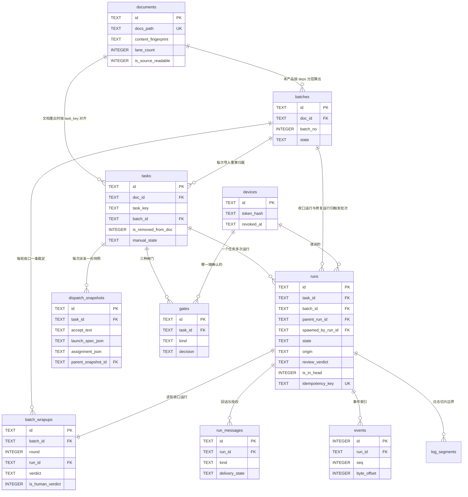
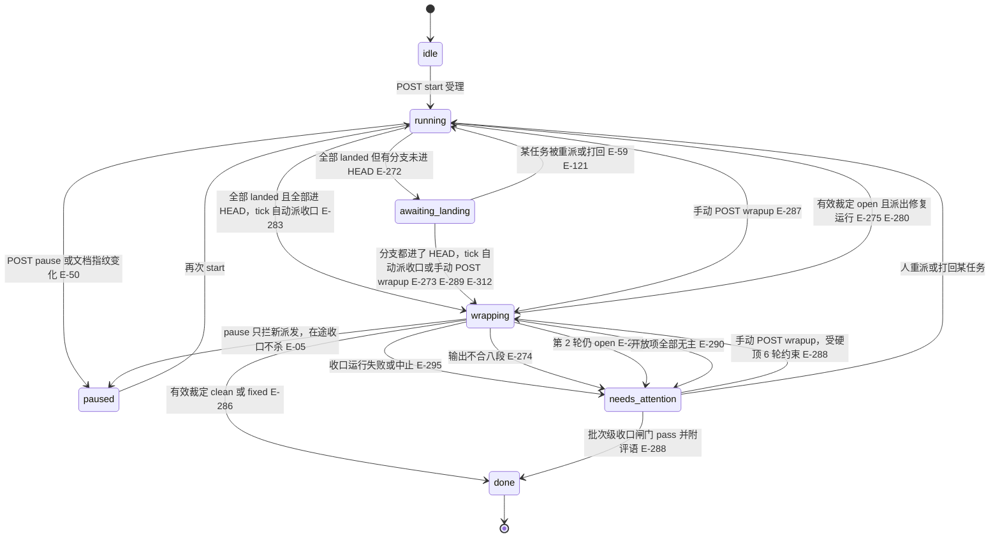
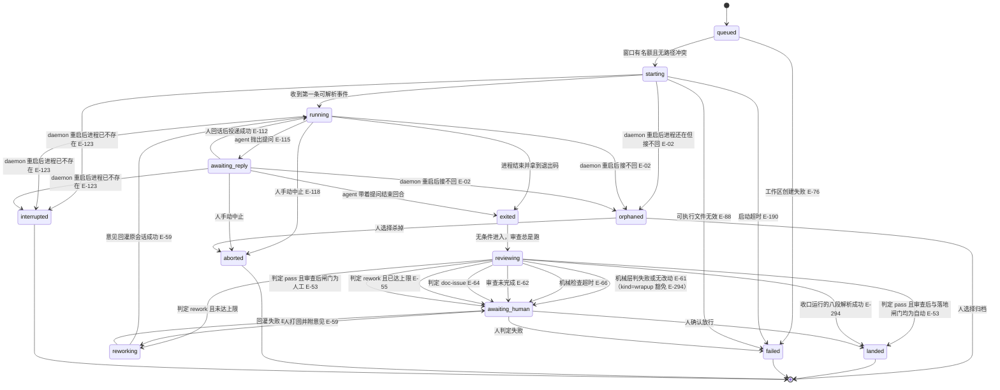

# 数据模型

存储分两处，**分工是硬约束**（见 08 节）：
**SQLite 只存结构化与可筛选字段，日志正文只存文件**，库里任何列都不得存事件 payload 正文。

数据根目录由 `platform.appDataDir(hostInputs)` 决定并且必须是规范化的本机绝对路径：
Windows 使用绝对 `APPDATA`，缺失或非绝对时回落 `homedir/AppData/Roaming`；macOS 使用
`homedir/Library/Application Support`；Linux 使用绝对 `XDG_DATA_HOME`，缺失或非绝对时
回落 `homedir/.local/share`，最后追加 `agent-scheduler`。这里的 `homedir`、`APPDATA`、
`XDG_DATA_HOME` 都是 boot 注入的值，不做 shell 展开（E-271）。根目录内部结构三平台完全一致：

```
〈data-dir〉/
├── daemon.json          进程配置（端口/绑定/日志级别），启动读一次
├── agents.json          agent 注册表，热加载
├── app.db               SQLite 主库（WAL）
└── runs/〈runId〉/
    ├── raw.log          stdout/stderr 交错的原始行
    └── events.ndjson    每行一个归一化事件信封（全量原文，永不截断）
```

## 实体一览

| 实体 | 说明 | 主键 |
|---|---|---|
| `documents` | 接入的每一份开发文档 | `id` |
| `tasks` | 从文档读入的任务，随文档重新导入而更新 | `id` |
| `batches` | **本产品按 `tasks[].deps` 拓扑分层算出的批次**（分层规则与阅读器一致，见下），带七值批次状态 | `id` |
| `batch_wrapups` | 每一轮收口的裁定记录（有效裁定、自报裁定、八段原文、开放项、派出的修复运行），只 INSERT 不 UPDATE | `id` |
| `runs` | 一个任务的一次执行（实施、审查或查 bug），或一个批次的一次收口（`kind='wrapup'`，无任务） | `id` |
| `dispatch_snapshots` | 派发那一刻的三段快照与启动载荷 | `id` |
| `gates` | 闸门的待确认与已决记录 | `id` |
| `run_messages` | 回话与授权消息，含未送达记录 | `id` |
| `events` | 事件**索引**（只收里程碑事件，不存正文） | `id` |
| `log_segments` | 日志文件的切片边界 | `id` |
| `devices` | 已配对设备 | `id` |
| `event_seq` | 事件 id 的水位表 | `name` |
| `settings` | 本产品的全局设置（`gates` 与 `pipeline` 两键），key/value 一行一键 | `key` |
| `schema_migrations` | 迁移记录 | `version` |

> **agent 注册表不是表**——它是 `agents.json` 文件（决策 15 的数据层），支持热加载。
> 派发时把条目**逐字段深拷贝**进 `dispatch_snapshots.launch_spec_json`，
> 在途运行只读快照（E-93）。
> 补充需求 2026-09-12（二）给每个 agent 条目加五个数据层字段（决策 108–110、113、117，出厂值按 04 节实测）：
> `loginProbe {args[], parser: 'codex_login_status'|'claude_auth_json'|'grok_models_exit'|'pi_auth_check'|'none', loggedInPattern, loggedOutPattern, loginCommandHint}`、
> `modelsLive {kind: 'command'|'codex_app_server'|'none', args[], parser: 'grok_models_text'|'pi_list_models_table'|'codex_model_list_jsonrpc'|'none', timeoutMs: 1000–15000，出厂 5000、codex 10000}`、
> `builtinModels: [{name, note}]`（claude 出厂 `opus` / `sonnet` / `haiku` / `opus[1m]`，其余空）、`defaultEffortTier: EffortValue`（出厂 null）、`effortVendorMap {low, medium, high} | null`（出厂：codex／grok／pi `{low:'low', medium:'medium', high:'high'}`，claude `{low:'2048', medium:'8192', high:'32768'}`，dsh 恒 null）。
> 注册表只装命令参数、正则源串与值，不装解析逻辑；`loginProbe.args` 含 `print-api-key` / `print-bearer-token` / `--credentials` 即 `invalid-config` 拒绝（E-353）；
> `{provider}` 变量标记只允许在 `parser='pi_auth_check'` 的 `args` 里（E-349）；缺字段回落内置默认，第 6 家回落 `GENERIC_AGENT_FIELD_DEFAULTS`（全 `none` / 空 / null）。
> **history 来源不建表**：从 `runs` 按 `agent_id` 派生一条 SQL（E-340，决策 114）。

## 批次是本产品算的，不是文档给的

`docs-data.js` 的输入协议为 `schemaVersion: 1`，保留 `project` / `generated` / `review` / `groups` / `data` / `pres` / `index`，并提供 `handoff` 与 `dispatch`。
**它仍不导出任务的 batchNo 或运行时 laneCount**：交接台的任务层号由 `deps` 计算，窗口数来自阅读器自身设置。

因此：

- **批次由本产品自己推导**，但**分层规则与阅读器逐字一致**，使批次号天然对得上：
  **层号 = 最长前驱链长度，无前驱为 0，成环就地截断为 0，显示号 = 层号 + 1**。
  这是一个十来行的纯函数、不含任何运行时状态，实现收敛在决策 4 已定的**唯一适配器模块**内，
  并在注释里注明对应上游的 `layerOf`。
- **并行窗口数是本产品自己的设置**（默认 2，可调 1–6，按文档持久化在自己的库里）。
  **明确不移植上游的 `bestLanes()`**——它经 `planLanes()` 读阅读器的进度 localStorage，
  而决策 14 已让两边进度账本各自为政，移植只会换来一个必然不同的数（决策 48、49）。
- **批次号不作任何持久标识**：`tasks.batch_id` 每次导入按当前分层重算；
  历史派发记录只认任务 id 与派发快照，**不认批次号**（E-243）。

## 文档接入的字段与版本

M3 只以 UTF-8 读取 `window.DOCS = JSON;`，剥离固定外壳后 `JSON.parse`；不得执行项目 JavaScript、阅读器函数或提示词内命令。采用 04 节列出的协议字段：

| 来源 | 本产品字段或用途 |
|---|---|
| `data.tasks[]` | 任务 ID、标题、依赖、输入、产出、验收与边界，字段保持原样 |
| `dispatch[id].contractHash` | `tasks.contract_hash`；须与 `handoff.contracts[id].hash` 和 `handoff.readiness[id].contractHash` 相同 |
| `dispatch[id].implementation` / `.review` | `tasks.impl_prompt` / `review_prompt`，逐字存储，不从 HTML 反推 |
| `handoff.effectivePaths[id]` | `tasks.task_paths_json`；已合并 taskPaths 与 supportPaths，调度与冲突检测共用此范围 |
| `handoff.readiness[id].ready` / `.reasons` | `tasks.is_contract_ready` / `contract_reasons_json`；供新派发检查与错误说明 |
| `dispatch[id].resume` | 供文档维护工具续做；产品仍沿原会话回话通路返工，不增加独立入口 |

协议版本不是 1、必需任务包缺失、三处任务哈希不一致、路径非法或提示词不是字符串时，按 E-82 报文档源不可读，保留全部既有任务与快照，冻结新派发。合法但 `ready=false` 是任务文档待复核，不是解析失败；仅阻止该任务新派发，沿既有错误展示通路说明原因，使用 `E_DOC_CONTRACT_PENDING`。本产品不调用文档维护命令、不写回文档证据。

文档级 `content_fingerprint` 是按任务 ID 排序的 `[id, contractHash]` 列表的哈希。任务 ID 增删、有效范围、边界、相关条款或提示词编译器变化都能被识别；不使用 `generated`、mtime 或任务排序。任务行不变而契约哈希变化时也触发 E-50 的后续派发暂停。

每次成功读取都刷新文档契约复核元数据；仅 `ready/reasons` 变化且契约哈希相同时，不设置验收／提示词变更标记、不改运行状态、不弹文档变化横幅。创建运行前核对 `is_contract_ready=1`，并将当前契约哈希、有效路径、输入、产出、验收和两段提示词一起写入派发快照。已派运行与历史审查始终使用该快照；重出文档不得热改在途运行（E-19、E-50、E-79、E-81）。

## 字段定义

命名遵循 06 节：表名 `snake_case` 复数，列名 `snake_case`，
时间列 `_at` 后缀且**存 ISO8601 文本**，布尔列存 `0/1` 且带 `is_`/`has_` 前缀。

### documents

| 列 | 类型 | 约束 | 说明 |
|---|---|---|---|
| `id` | TEXT | PK | |
| `docs_path` | TEXT | NOT NULL, UNIQUE | `docs-data.js` 的绝对路径 |
| `project_name` | TEXT | NOT NULL | 取自 `window.DOCS.project` |
| `repo_path` | TEXT | NULL | 取自 `pres.handoff.repo`，可为空 |
| `main_branch` | TEXT | NOT NULL DEFAULT 'main' | |
| `branch_prefix` | TEXT | NOT NULL DEFAULT 'task/' | |
| `lane_count` | INTEGER | NOT NULL DEFAULT 2 | **本产品自有的并行窗口设置**，值域 1–6（决策 48） |
| `content_fingerprint` | TEXT | NOT NULL | 按任务 ID 排序的 `[id, contractHash]` 列表的哈希；禁止用 `generated` 或 mtime（E-17） |
| `is_source_readable` | INTEGER | NOT NULL DEFAULT 1 | 解析失败置 0，冻结新派发但保留全部记录（E-82） |
| `is_takeover_notified` | INTEGER | NOT NULL DEFAULT 0 | 接管横幅是否已展示过（E-84） |
| `imported_at` | TEXT | NOT NULL | |
| `last_seen_at` | TEXT | NOT NULL | |

### batches

| 列 | 类型 | 约束 | 说明 |
|---|---|---|---|
| `id` | TEXT | PK | |
| `doc_id` | TEXT | NOT NULL, FK→documents ON DELETE RESTRICT | |
| `batch_no` | INTEGER | NOT NULL | 层号 + 1；`(doc_id, batch_no)` UNIQUE |
| `state` | TEXT | NOT NULL DEFAULT 'idle' | 七值，见下方「批次状态机」：`idle` / `running` / `paused` / `awaiting_landing` / `wrapping` / `needs_attention` / `done` |
| `started_at` | TEXT | NULL | |
| `finished_at` | TEXT | NULL | `done` 时写 |

批次行按 `(doc_id, batch_no)` upsert，**永不删除**：文档重出重算分层时只改任务的归属，
批次行的 `state` 与已有收口记录原样保留（E-243 的扩展）。收口轮次不落列，
取 `batch_wrapups` 里该批的最大 `round`；「能否收口」「默认展开」都是 service 层按状态算出的 DTO 派生字段，不落库。

### batch_wrapups

| 列 | 类型 | 约束 | 说明 |
|---|---|---|---|
| `id` | TEXT | PK | |
| `batch_id` | TEXT | NOT NULL, FK→batches ON DELETE RESTRICT | |
| `batch_no` | INTEGER | NOT NULL | 收口那一刻的批次号快照，重出分层后仍可读 |
| `tasks_json` | TEXT | NOT NULL | 收口那一刻本批 task_key 的排序数组，任务集变化后旧记录只读展示不参与触发 |
| `round` | INTEGER | NOT NULL, CHECK ≥1 | 轮次；`(batch_id, round, is_human_verdict)` UNIQUE——同一轮允许「机器裁定 + 人工裁定」各一行（E-288） |
| `run_id` | TEXT | NOT NULL, FK→runs, UNIQUE | 该轮收口运行 |
| `verdict` | TEXT | NOT NULL | **有效裁定** `clean` / `fixed` / `open`，由 `domain/wrapup-report.ts` 从内容算出，**不是 agent 自报**（E-286） |
| `declared_verdict` | TEXT | NULL | RECORD 段自报值，解析不到为 NULL |
| `is_human_verdict` | INTEGER | NOT NULL DEFAULT 0 | 人对批次级收口闸门 pass 时置 1，此时 `verdict='clean'`、`summary_text` 为评语 |
| `prompt_source` | TEXT | NOT NULL | `docs` / `builtin`（E-296） |
| `tests_json` | TEXT | NOT NULL | `{status: 'pass'|'fail'|'skipped'|'unknown', items: string[]}` |
| `summary_text` | TEXT | NOT NULL | BATCH_SUMMARY 段原文，或人工裁定的评语 |
| `findings_json` | TEXT | NOT NULL | 开放项与已修项：`{id, kind: 'bug'|'not_fixed'|'test_failure', severity, taskKey, crossBatch, isFixed, isWellFormed, raw, …}` |
| `unassigned_json` | TEXT | NOT NULL | 解析不出任务 ID 的开放条目原文数组（E-290） |
| `fix_run_ids_json` | TEXT | NOT NULL | 本轮派出的修复运行 id，派不出为 `[]` |
| `report_text` | TEXT | NOT NULL | 八段原文的裁定副本，供人一键投递与复核；**不是**事件 payload，也不含流式 chunk |
| `created_at` | TEXT | NOT NULL | |

**索引**：`(batch_id, created_at)`。本表只在 `recordWrapupResult()` 与人工裁定的事务里 INSERT，**永不 UPDATE**。

### settings

| 列 | 类型 | 约束 | 说明 |
|---|---|---|---|
| `key` | TEXT | PK | `gates` / `pipeline` |
| `value_json` | TEXT | NOT NULL | `gates`：`{dispatch, review, landing}` 各 `auto` / `manual`；`pipeline`：`{bughunt: 0｜1, wrapupMode: 'auto'｜'manual', reviewOverride: {agentId, modelName?, effortTier?} ｜ null, wrapupAssignment: {mode:'follow'} ｜ {mode:'fixed', agentId, modelName?, effortTier?}}` |
| `updated_at` | TEXT | NOT NULL | |

缺 `gates` 行时返回内置默认 `{dispatch: 'auto', review: 'manual', landing: 'manual'}` 且不插行；
`value_json` 非法或含未知值时回落默认并 warn，不退出、不覆盖坏值直到下一次 PATCH（E-292）。
缺 `pipeline` 行时同法返回 `{bughunt: 0, wrapupMode: 'auto', reviewOverride: null, wrapupAssignment: {mode: 'follow'}}`；PATCH **四字段整体写入**，写成功发 `settings.pipeline_changed`（E-318、E-356，决策 93、107、116）。
旧行只有两键时读侧补默认、不改写库；`reviewOverride` 与 `wrapupAssignment` 的 `agentId` 必须存在于注册表快照，`effortTier` 只收三档；两项设置本体不进快照、不进 `gates`，算出的结果进 `dispatch_snapshots.assignment_json`。JSON 列扩子键不需迁移。
两键都是全局的、不挂文档；`lane_count` 仍留在 `documents`（按文档持久化，决策 48），它同时是运行甲板的泳道数（决策 87）。

### tasks

| 列 | 类型 | 约束 | 说明 |
|---|---|---|---|
| `id` | TEXT | PK | |
| `doc_id` | TEXT | NOT NULL, FK→documents ON DELETE RESTRICT | |
| `task_key` | TEXT | NOT NULL | 文档里的 `M1-T1`。`(doc_id, task_key)` UNIQUE |
| `title` | TEXT | NOT NULL | |
| `module_key` | TEXT | NOT NULL | |
| `deps_json` | TEXT | NOT NULL | 前置任务 key 数组 |
| `input_text` | TEXT | NULL | |
| `output_text` | TEXT | NULL | |
| `accept_text` | TEXT | NULL | |
| `edge_ids_json` | TEXT | NULL | 验收标准里引用的 `E-XX` |
| `task_paths_json` | TEXT | NULL | 取自 `handoff.effectivePaths[id]`，用于冲突判定 |
| `contract_hash` | TEXT | NOT NULL | 当前任务契约版本，与源中三处哈希一致 |
| `is_contract_ready` | INTEGER | NOT NULL DEFAULT 0 | 文档契约已复核且版本有效；不代表代码已验收 |
| `contract_reasons_json` | TEXT | NOT NULL | 文档待复核或被阻断的原因数组，通过时为 `[]` |
| `est_days` | REAL | NULL | |
| `batch_id` | TEXT | NULL, FK→batches | **每次导入按当前分层重算** |
| `impl_prompt` | TEXT | NULL | |
| `review_prompt` | TEXT | NULL | |
| `is_removed_from_doc` | INTEGER | NOT NULL DEFAULT 0 | 文档重出后不存在则置 1，**不删记录**（E-77） |
| `has_accept_changed` | INTEGER | NOT NULL DEFAULT 0 | 决策 13 的三个标记之一 |
| `has_prompt_changed` | INTEGER | NOT NULL DEFAULT 0 | 两段提示词或契约哈希相对最近派发快照变化；包含范围／条款变化 |
| `manual_state` | TEXT | NULL | 人工判定的终态（E-78） |
| `bug_prompt` | TEXT | NULL | 导入时逐字存 `dispatch[id].bug`（查 bug 提示词，未落地措辞）；缺失或非字符串存 NULL，不冻结派发（E-316，M3-T7） |
| `lane_no` | INTEGER | NULL | 该任务当前占的泳道号（1…`lane_count`）；**槽位按任务计**：任务派出即写、等人（`awaiting_human`）或终态即置 NULL；`(doc_id, lane_no)` 部分唯一索引 `WHERE lane_no IS NOT NULL`，daemon 重启后不变（E-311，M8-T8） |

**`tasks` 没有 `state` 列。** 任务状态是**派生值**，取值规则写死为：

> `manual_state` 非空 → 用它；否则取该任务 **`attempt_no` 最大的那次 `runs.state`**；
> 一次都没派过 → `never_dispatched`。

任务另有两个派生标记，都在同一个 `domain/task-state.ts` 里算，**不落列**：

- **进 HEAD**（`inHead: boolean | null`）：取 `attempt_no` 最大的实施运行，`landed` → `runs.is_in_head === 1`；
  未 landed 或从未派 → `null`（前端显示「—」）。`inHeadMethod` 一并给出（E-298）。
- **批次级计数**（已落地 x/n、在跑 y、等你 z）按「最近一次**非修复**运行」计：
  `origin='wrapup-fix'` 的在途运行不让已验收的任务从「已落地」计数里退出，
  只在任务行标「跨批修复中」并呼吸（E-275）。任务详情页仍显示最大 attempt 的运行状态——两处口径在这里写明，不散落。

派生在 **service 层**完成（`domain/task-state.ts` 的纯函数），
**禁止在前端内存过滤**。`GET /documents/:docId/tasks?state=` 的筛选
按同一规则在 SQL 里用 `LEFT JOIN` 最新一次 run 实现，
值域 = 运行状态全集 + `never_dispatched`。

### runs

一个任务可以有多次运行。**进度只展示最近一次，历史可展开**（E-27）。

| 列 | 类型 | 约束 | 说明 |
|---|---|---|---|
| `id` | TEXT | PK | |
| `task_id` | TEXT | NOT NULL, FK→tasks | |
| `attempt_no` | INTEGER | NOT NULL | 同一任务内递增；`(task_id, attempt_no)` UNIQUE |
| `kind` | TEXT | NOT NULL | `implement` / `review` / `wrapup` / `bughunt`；CHECK `((kind='wrapup') = (task_id IS NULL))`（查 bug 运行挂任务）。扩到四值随 M8-T6 的四表重建一起做（E-291） |
| `task_id` | TEXT | NULL, FK→tasks | **只有 `kind='wrapup'` 允许为 NULL**（收口运行不挂任务） |
| `batch_id` | TEXT | NULL, FK→batches | `kind='wrapup'` 与 `origin='wrapup-fix'` 必填（触发批次；跨批修复也填触发批），其余 NULL——普通运行沿 `tasks.batch_id` 派生，不把批次号持久化（E-243） |
| `origin` | TEXT | NOT NULL DEFAULT 'dispatch' | `dispatch`（批次派发／手动／重跑／审查／收口／查 bug）/ `rework`（返工运行，决策 60 第三分支）/ `wrapup-fix`（收口修复运行，决策 63；人工撤回也用它，E-293） |
| `spawned_by_run_id` | TEXT | NULL, FK→runs | `origin='rework'` 指向产生返工块的审查运行；`origin='wrapup-fix'` 指向收口运行（人工撤回为 NULL）。与 `parent_run_id` 语义不同，**禁止混用** |
| `parent_run_id` | TEXT | NULL, FK→runs | **`kind='review'` 与 `kind='bughunt'` 的运行都指向被它审查／排查的那次实施运行** |
| `review_round` | INTEGER | NULL | 只在 `kind='review'` 行上写，从 1 起：第 1 轮审查为 1，第 N+1 轮续接（同一任务、同一 `vendor_session_ref` 的新审查行）为 N+1，查 bug 触发的再审同样 +1；索引 `(task_id, kind, review_round)`（决策 89，M7-T7） |
| `continued_from_run_id` | TEXT | NULL, FK→runs | 第 N+1 轮审查行指向第 N 轮审查行；第 1 轮为 NULL；唯一索引 `ux_runs_continued(continued_from_run_id) WHERE continued_from_run_id IS NOT NULL`——一轮只能被续接一次（E-304） |
| `prompt_source` | TEXT | NULL | `kind='bughunt'` 行写 `docs` / `builtin`（E-316）；收口运行沿用 `batch_wrapups.prompt_source`，本列为 NULL |
| `lane_no` | INTEGER | NULL | 该运行跑在哪条泳道：implement 行 INSERT 时与 `tasks.lane_no` 同值、review / bughunt 行 INSERT 时抄自 `tasks.lane_no`、wrapup 行 INSERT 或后续分槽时写；终态后保留作历史（历史行按它归位）；索引 `(lane_no) WHERE lane_no IS NOT NULL`（E-325） |
| `session_archived_at` | TEXT | NULL | 该运行的会话被归档的时刻：实施行到终态时由 M6-T10 一次性写该任务全部运行；收口运行到终态时由 `recordWrapupResult()` 自己写；非 NULL 后 `vendor_session_ref` 只读，向它投递消息或续接返回 `E_SESSION_ARCHIVED`（E-302） |
| `state` | TEXT | NOT NULL | 见下方状态机 |
| `review_verdict` | TEXT | NULL | `pass` / `rework` / `doc_issue` / `incomplete`（E-62、E-63）；返工块解析不出结构也记 `incomplete`（E-278） |
| `rework_text` | TEXT | NULL | 只在 `kind='review'` 行上写：`rework` 围栏块优先，其次 REWORK 段条目全文；未结构化时存原文全文，**不截断**（决策 59） |
| `is_in_head` | INTEGER | NOT NULL DEFAULT 0 | 该运行的分支已进当前 HEAD；由 `scheduler-tick` 刷新，**一旦为 1 不回 0**（E-301） |
| `in_head_checked_at` | TEXT | NULL | 最近一次进 HEAD 判定时间，供节流 |
| `branch_tip_sha` | TEXT | NULL | tick 在分支存在时记下的分支尖 commit，分支被删后仍可判定（E-289） |
| `agent_id` | TEXT | NOT NULL | 注册表里的 agent |
| `model_name` | TEXT | NULL | 空表示「跟随 agent 配置」（E-35） |
| `reported_model` | TEXT | NULL | agent 自报的实际模型，与所选不一致时高亮（E-37） |
| `effort_tier` | TEXT | NULL | 思考强度三档 `low` / `medium` / `high`。**NULL 表示「该 agent 不支持」或「跟随其配置」，UI 显示「—」而不补默认档**（决策 52、E-254） |
| `reported_effort` | TEXT | NULL | agent 自报的实际思考强度；与所选不一致时高亮，处理方式与 `reported_model` 对称（E-256） |
| `effort_vendor` | TEXT | NULL | 思考强度的**厂商原值**（如 codex `xhigh`），与 `effort_tier` **恒不同时非空**；`EffortValue = {tier} ｜ {vendor} ｜ null` 经 `domain/effort-value.ts` 唯一转换；`vendor` 只允许来自配置当前值或 live 取值域（决策 110、117，E-351）；普通 `ADD COLUMN`，旧行 NULL |
| `assignment_source` | TEXT | NULL | 这条运行的 agent／模型／思考强度来自哪一级：`task` / `review_override` / `wrapup_settings` / `agent_default`，由 `resolveAssignment()` 算出随 `RunDto` 下发，参照条据此显示「来源」（决策 107、111，E-341、E-347）；普通 `ADD COLUMN`，旧行 NULL 读作 `task`。**被跟随任务不另加列**：`RunDto.followedTaskId` 由 service 从 `snapshot_id` 对应快照的 `assignment_json` 联结取（决策 129） |
| `permission_tier` | TEXT | NOT NULL | `readOnly` / `workspaceWrite` / `unrestricted` |
| `snapshot_id` | TEXT | NOT NULL, FK→dispatch_snapshots | **在 `POST /runs` 落库时立刻写**，`queued → starting` 不再重读注册表 |
| `worktree_path` | TEXT | NULL | 来自 M5 |
| `branch_name` | TEXT | NULL | 同上 |
| `pid` | INTEGER | NULL | 用于 daemon 重启对账（E-123） |
| `exit_code` | INTEGER | NULL | |
| `exit_signal` | TEXT | NULL | |
| `vendor_session_ref` | TEXT | NULL | 厂商会话文件路径，**只读引用不拷贝**（E-96）；同一任务的续接审查行与首轮相等，**不同任务的任何两条运行不得相等**（E-303，service 校验 + arch 测试）；`session_archived_at` 非 NULL 后只读 |
| `changed_file_count` | INTEGER | NULL | 由 git diff 得出 |
| `token_usage_json` | TEXT | NULL | 拿不到时为 NULL，UI 显示「—」**不得拿 0 冒充**（E-26） |
| `unmapped_event_count` | INTEGER | NOT NULL DEFAULT 0 | 未知厂商事件计数（E-202） |
| `is_stall_suspected` | INTEGER | NOT NULL DEFAULT 0 | **弱标记，不是状态**（E-120） |
| `rework_count` | INTEGER | NOT NULL DEFAULT 0 | 自动重试上限 2（E-55）。同一任务因返工新建的 run（`origin='rework'`，含恢复后回灌）**继承并 +1**；换 agent 重派或收口修复（`origin='wrapup-fix'`）从 0 起算——换 agent 视为人工介入，修复运行是新一件事 |
| `queued_reason` | TEXT | NULL | 处于 `queued` 的原因（如被哪个 run 的路径冲突挡住，E-46） |
| `idempotency_key` | TEXT | UNIQUE | 防两端同时派发起两个进程（E-126） |
| `actor_device_id` | TEXT | NULL, FK→devices | 谁派的；系统发起为 NULL（E-128） |
| `started_at` | TEXT | NULL | |
| `last_event_at` | TEXT | NULL | 供停滞检测 |
| `ended_at` | TEXT | NULL | |

**索引**：`(task_id, attempt_no)`、`(state)`、`(agent_id, state)`（算每 agent 并发）、`(last_event_at)`、`(parent_run_id)`、`(parent_run_id, kind)`、
`(spawned_by_run_id)`、`(batch_id, state)`、`(state, is_in_head)`（tick 扫「landed 且未进 HEAD」）、`(task_id, kind, review_round)`、`(lane_no) WHERE lane_no IS NOT NULL`、
唯一索引 `ux_runs_continued(continued_from_run_id) WHERE continued_from_run_id IS NOT NULL`，
以及唯一部分索引 `(batch_id, attempt_no) WHERE kind='wrapup'`——收口运行的 `attempt_no` 就是轮次，一批一轮只有一条（E-283）。

### dispatch_snapshots

| 列 | 类型 | 约束 | 说明 |
|---|---|---|---|
| `id` | TEXT | PK | |
| `task_id` | TEXT | NULL, FK→tasks | 收口运行的快照为 NULL；CHECK `(task_id IS NOT NULL) <> (batch_id IS NOT NULL)` |
| `batch_id` | TEXT | NULL, FK→batches | 只有收口运行的快照填 |
| `input_text` | TEXT | NULL | 派发那一刻的逐字副本（E-19） |
| `output_text` | TEXT | NULL | 同上 |
| `accept_text` | TEXT | NULL | 同上 |
| `impl_prompt` | TEXT | NULL | 同上 |
| `review_prompt` | TEXT | NULL | 同上 |
| `bug_prompt` | TEXT | NULL | 派发那一刻 `tasks.bug_prompt` 的逐字副本；查 bug 运行只读这一份，NULL 时用内置通用提示词（E-316） |
| `contract_hash` | TEXT | NOT NULL | 派发时的任务契约哈希，供审查与后续变更比对 |
| `task_paths_json` | TEXT | NOT NULL | 派发时的有效路径，不被后续文档更新覆盖 |
| `launch_spec_json` | TEXT | NOT NULL | 注册表条目的逐字段深拷贝，**永不迁移**（E-93）；含五个新字段；**不再从它推导阶段的 agent／模型／思考强度** |
| `assignment_json` | TEXT | NULL | 任务指派快照 `{agentId, modelName, effortTier, effortVendor, source: 'task' ｜ 'wrapup_settings', followedTaskId, capturedAt}`：首次派发时写，该任务后续审查／返工／查 bug 阶段都读这一份；收口快照 `source='wrapup_settings'`、`followedTaskId` 在跟随模式为被跟随任务；**只写不改**，旧行 NULL 读侧用该快照首条 `runs` 行合成、不回填（决策 107，E-341、E-343、E-344） |
| `parent_snapshot_id` | TEXT | NULL, FK→dispatch_snapshots | 跨家审查覆盖时为审查运行建的**子快照**指向实施快照：文本列、`contract_hash`、`task_paths_json`、`bug_prompt`、`assignment_json` 逐字复制，`launch_spec_json` 换成覆盖 agent 当时的注册表副本；「最近快照」类查询一律 `parent_snapshot_id IS NULL`（决策 121，E-352）；普通 `ADD COLUMN` |
| `created_at` | TEXT | NOT NULL | |

### gates

| 列 | 类型 | 约束 | 说明 |
|---|---|---|---|
| `id` | TEXT | PK | `gateId`，可寻址 |
| `task_id` | TEXT | NULL, FK→tasks | 批次级收口闸门为 NULL，此时 `run_id` 必填（收口运行）；CHECK `(task_id IS NOT NULL OR run_id IS NOT NULL)` |
| `run_id` | TEXT | NULL, FK→runs | 派发前闸门尚无 run |
| `kind` | TEXT | NOT NULL | `dispatch` / `review` / `landing`；批次级收口闸门用 `review` 且 `task_id` 为 NULL（E-288） |
| `state` | TEXT | NOT NULL | `waiting` / `decided` |
| `decision` | TEXT | NULL | `pass` / `rework` / `reject`——**`rework` 是 E-59 人工打回的落点** |
| `comment` | TEXT | NULL | 打回时必须能附一句话（E-59） |
| `decided_by_device_id` | TEXT | NULL, FK→devices | 哪一端确认的（E-57） |
| `created_at` | TEXT | NOT NULL | |
| `decided_at` | TEXT | NULL | |

**幂等**：`state='decided'` 时再次 decide 返回既有记录 + `E_GATE_ALREADY_DECIDED`，
并在 `details` 里带上是哪台设备、何时决的（E-57）。

### run_messages

| 列 | 类型 | 约束 | 说明 |
|---|---|---|---|
| `id` | TEXT | PK | 即 `messageId` |
| `run_id` | TEXT | NOT NULL, FK→runs | |
| `kind` | TEXT | NOT NULL | `reply` / `approve` / `deny` / `elevate_once`（E-133） |
| `text` | TEXT | NULL | `approve` / `deny` 可为空 |
| `delivery_state` | TEXT | NOT NULL | `delivered` / `undelivered`（E-113） |
| `undelivered_reason` | TEXT | NULL | 进程已死 / 管道已断 / 无注入能力位 |
| `actor_device_id` | TEXT | NULL, FK→devices | **每条记录来源设备与时间戳，不做去重合并**（E-114） |
| `created_at` | TEXT | NOT NULL | |
| `delivered_at` | TEXT | NULL | |

### events / log_segments / devices / event_seq

- `events(id INTEGER PK, run_id, task_id, seq, ts, scope, kind, actor_device_id, file_seq, byte_offset, byte_len)`——
  **只收里程碑事件**（`run.*` / `task.*` / `batch.*` / `system.*` / `agent.*` / `tool_call` / `tool_call_update` / `plan`）；
  高频 `*_chunk` 不进表
- `log_segments(id, run_id, stream, file_seq, path, byte_start, byte_end, line_count)`——
  200MB 切片边界（E-149）；**`line_count` 供虚拟列表算总行数**
- `devices(id, name, token_hash, token_salt, paired_at, last_seen_at, revoked_at)`——
  **令牌只存 scrypt 哈希 + 盐，绝不存明文**
- `event_seq(name, watermark)`——水位预分配，每 1000 个写一次库

## ER 图

> 与数据流图同样说明：`diagram-generator` 技能在本机不存在（见 24 节），本图按其规格手绘。
> 阅读器只渲染 `sequenceDiagram` 与 `stateDiagram-v2`，**本图以源码显示**；Obsidian 里正常渲染。



> `runs.parent_run_id`（审查运行 → 被审查的实施运行）与 `runs.spawned_by_run_id`（返工运行 → 审查运行；修复运行 → 收口运行）
> 都是指向 `runs` 自身的自引用外键。mermaid 的 erDiagram 画自引用会退化成一条无意义的自环，故只在字段表里声明，图上不画。

## 批次状态机

`batches.state` 的迁移表同样是**白名单**，收敛在 `domain/batch-state-machine.ts` 的 `canTransitionBatch(from, to)`，
只有 `service/batch.ts` 的 `transitionBatch()` 能改这一列，每次成功迁移都发一条 `batch.advanced`（payload 带 `from` / `to` / `reason`）。
禁止在 repo、jobs、routes 里直接 UPDATE 它；禁止把 `done` 当「全部 landed」的同义词——全部已验收但未收口的批次是 `awaiting_landing` 或 `wrapping`。



`done` 零出边：跨批修复运行给已 done 的批次派活时，任务行归其原批次、运行归触发批次，
已 done 的批次不重触发收口、`done` 不回退（E-275）。
收口模式为手动（`settings.pipeline.wrapupMode='manual'`）时 `running → wrapping` 与 `awaiting_landing → wrapping` 两条边只由 `POST /batches/:id/wrapup` 触发，
tick 不自动走；批次状态与边集合不因模式变化（E-312）。

## 运行状态机

**这是本产品最要紧的一张图。** 决策 5 的核心断言就画在这里：
**`exited`（已退出）与 `landed`（已落地）之间隔着审查，退出码为 0 不构成落地。**

**迁移表是白名单，不是黑名单。** `canTransition(from, to)` **只对下图画出的边返回 true**，
其余一律抛 `E_INVALID_STATE_TRANSITION`。下方的「非法迁移」小节只是白名单的注释，
**不是实现依据**——按黑名单实现会让 `queued → landed`、`failed → running` 全部放行。

**审查总是跑，审查后闸门只决定「审查完了要不要人确认」。**
把闸门用在「要不要进入审查」上是错的——那会让机械检查与审查 agent 被整段跳过。



### 非法迁移（白名单之外的一切都非法，下面只是最容易写错的几条）

| 禁止的迁移 | 为什么 |
|---|---|
| `exited → landed` **直接跳过审查** | 退出码 0 不等于活干完了（E-23、决策 5）。落地闸门设为自动也不改这条——自动只是 `reviewing → landed` 那条边可达 |
| `exited → awaiting_human` **跳过审查** | 审查后闸门管的是「审查完了要不要人确认」，**不是「要不要审查」**；跳过会让 E-60 / E-61 / E-135 整段失效 |
| `running → landed` | 进程还没结束就不可能有产出可验收 |
| 任何状态 → `running` **除了** `starting` / `awaiting_reply` / `reworking` | 运行中的进程只有这三条入口 |
| **`landed` / `failed` / `aborted` / `interrupted` 四个终态零出边** | 不可逆。要继续只能新建一次运行 |
| `reworking` 次数 > 2 后再进 `reworking` | 自动重试上限 2，超限必须转人（E-55） |
| `queued → running` 跳过 `starting` | 启动超时与思考超时是两个独立计时器，跳过就失去启动窗口的计时基准（E-190） |

### 不占并发额度的状态

**`landed` 的语义是「已验收」**：审查 pass 且闸门放行（自动或人工）。它**不表示分支已合进 HEAD**——
合入由人做，产品只用 `runs.is_in_head` 派生出「进 HEAD」标记（决策 64、E-298）。

**`kind='wrapup'` 的运行走同一张状态机**，但 `exited → reviewing` 之后做的是八段解析而不是派审查 agent：
解析成功 → `landed`（批次按有效裁定迁移）；解析失败或运行失败 → `awaiting_human` 并开批次级收口闸门（E-274、E-295）。
它豁免 E-61 的「空 diff 判失败」——收口可以一行不改（E-294）。

**`kind='bughunt'` 的运行同样走同一张状态机**（决策 91）：`queued → starting → running → exited → reviewing → landed | awaiting_human`，
进 `reviewing` 后只做五段解析、不跑机械检查、不派审查 agent，同样豁免空 diff（E-321）；它挂在被审实施运行上（`parent_run_id`），
查 bug 期间被审实施行停在 `reviewing` 不动，结果按 E-307／E-308／E-320／E-323 决定实施行走 `reviewing → landed`、`→ awaiting_human` 还是再审。

**`awaiting_human` 与 `orphaned` 不计入「每 agent 并发上限」**——
前者是 E-54 的明文要求（等人时释放窗口），后者同理：接不回来的运行不该占着名额。
**`awaiting_reply` 仍然占用**（E-115 明确要求）。

### 泳道槽位与会话归档（决策 87、88）

**槽位按任务计，不按运行计。** `tasks.lane_no` 非空即占一个槽（该任务的实施、审查、查 bug 运行共用），
`kind='wrapup'` 且 `runs.lane_no` 非空且非终态的收口运行也占一个槽；槽位上限是 `documents.lane_count`。
agent 并发上限仍按运行计（M8-T1 的两个函数原样复用），审查与查 bug 运行各占该 agent 1 名额但不占槽（E-311）。
派出（tick 补位、手动派发、人打回后重新入道）时写 `tasks.lane_no`；实施行迁 `awaiting_human` 或终态、收口运行迁终态时置 NULL（E-54、E-326）。

**`lanes[]` 是派生数据，不落表**：`domain/lanes.ts` 的 `deriveLanes()` 由 `lane_count`、全部 tasks（含 `lane_no` / 派生状态 / 层号 / 前置）、全部 runs（含已归档）与
M8-T2 的可放行集合算出，`GET /snapshot` 每次现算，随 `lane.assigned` / `lane.released` / `document.settings_changed` / `task.sessions_archived` 事件让客户端重拉。
`stage` 值域 `LANE_STAGES = ['idle', 'queued', 'implement', 'rework', 'review', 'bughunt', 'wrapup']`（`awaiting_human` 与终态不是泳道阶段：前者已释放槽位、后者已归档；
实施行 `reworking` → `rework`，`queued` → `queued`，其余在跑态 → `implement`，`reviewing` → `review`）；
阶段链的显示顺序 `PIPELINE_STAGES = ['implement', 'review', 'bughunt', 'landing']`（`landing` 是阶段链末尾的虚拟节点，不是 `stage` 的取值；`rework` 与 `queued` 落在实施行，不是独立行）。
两个常量都在 `packages/shared/src/api/lanes.ts`，daemon 侧 arch 测试断言 `deriveLanes()` 可能产出的阶段集合与 `LANE_STAGES` 逐项相等（决策 104，E-332）。

**归档 = 会话到此为止，引用只读。** 实施行到终态的同一事务里，该任务全部运行行（implement / review / bughunt，任何 state）写 `session_archived_at`，
事务后对仍在注册表里的进程走 `killTree` 两阶段，残留 pid 进 `task.sessions_archived.residualPids`（E-302、E-322）。
归档后 `vendor_session_ref` 原样保留（E-96 只读引用），任何投递、回灌、续接命中它都返回 `E_SESSION_ARCHIVED`；
新建运行的引用不得等于其他任务任一运行的引用——同一任务多轮共享引用是允许的，所以这条由 service 校验与 arch 测试兜底，**不用唯一索引**（E-303）。
`awaiting_human` 与 `orphaned` 只释放槽位、不归档（决策 99，E-326）；人打回后返工排在全部新任务之前重新入道，泳道号可与原先不同（E-327）。

### 状态变更必须发事件

状态机每一次成功迁移**必须发一条 `run.state_changed`**（payload 带 `from` / `to` / `reason`），
由 service 在**事务返回后**统一发布。
否则 10 节「写操作的最终状态一律以回流事件为准」（E-157）在十三个状态里只有三个能被 UI 看到。

**`is_stall_suspected` 不是状态**，是挂在 `running` / `awaiting_reply` 上的弱标记；
停滞检测**只发弱事件、不改状态、不杀进程**（E-120）。
`awaiting_reply` 超时归类为「等人」而非「疑似停滞」（E-122）。

## 约束与索引

- **外键全开**（`foreign_keys=ON`）；`tasks.doc_id` 与 `batches.doc_id` 用
  **`ON DELETE RESTRICT`**——文档记录不允许被删，只置 `is_source_readable=0`（E-82）
- `runs.idempotency_key` 唯一，是两端并发派发的唯一防线（E-126）
- `(agent_id, state)` 索引供「每 agent 并发上限」实时计算
- `(last_event_at)` 索引供 stall-detector 30s tick 扫描
- 时间列一律 ISO8601 文本，**便于直接开库排查**

## 新增字段的兼容策略

1. **只增不改**：`migrations/NNNN_*.sql` 按序号新增，已应用的文件禁止修改
   （要改回来就再加一个迁移），**不写 down 脚本**
2. **新列必须可空或带默认值**——daemon 升级后要能直接读旧库，不做数据回填脚本
3. **`*_json` 列是有意的逃生口**（`deps_json` / `task_paths_json` / `token_usage_json`）：
   这类结构会随上游文档格式与厂商输出变化，用 JSON 列避免每次都加迁移；
   但**只允许存本产品自己定义的结构或原样透传的厂商字段**，
   不许把应该建索引的可筛选字段藏进 JSON
4. **`dispatch_snapshots.launch_spec_json` 是快照，永不迁移**——
   它记录的是「派发那一刻注册表长什么样」，改了就失去快照的意义（E-93）
5. 厂商私有字段一律进 `payload.vendor` 原样保留，
   **禁止为某一家新增顶层列或顶层 kind**（E-186）
6. **扩枚举 CHECK 与放宽 NOT NULL 走整表重建**：SQLite 不能 ALTER 这两样，
   迁移文件首行标 `-- requires: foreign_keys=off` 走 08 节写死的唯一例外（关外键 → 事务内重建 → `foreign_key_check` 零行 → 开回）；
   **重建不算改已应用文件**，四张表（batches、dispatch_snapshots、runs、gates）在同一个迁移里按被引用者先的顺序重建（E-291），
   `runs.kind` 扩到四值（含 `bughunt`）就在这次重建里做；重建时必须逐列保留当时 schema 里的全部既有列与索引（含 M6-T10 之前用普通迁移加的 `lane_no` / `session_archived_at`）
7. **本轮新列全部走普通 `ADD COLUMN`**（`bug_prompt`、`lane_no`、`session_archived_at`、`review_round`、`continued_from_run_id`、`prompt_source`），
   各归其任务（M3-T7 / M6-T10 / M7-T7 / M7-T8），默认 NULL、旧库直开不回填：旧审查行 `review_round` 为 NULL 时读侧按 1 处理
8. **补充需求 2026-09-12（二）的四个新列同样走普通 `ADD COLUMN`**（`runs.effort_vendor` 归 M4-T14；`runs.assignment_source`、`dispatch_snapshots.assignment_json`、`dispatch_snapshots.parent_snapshot_id` 同一个迁移文件归 M8-T9）；
   `runs.effort_tier` 的三档 CHECK **不改**——厂商原值走新列而不是扩 CHECK，避免一次整表重建（决策 117）；M4-T14 与 M8-T6 互不依赖，M8-T6 的四表重建若晚于 M4-T14 落地必须逐列保留 `effort_vendor`（`migrate-rebuild` 的 fixture 含该列）；M8-T9 依赖 M8-T6，其三列恒在重建之后加；`settings.pipeline` 扩子键走 JSON 列不需迁移（E-356）
