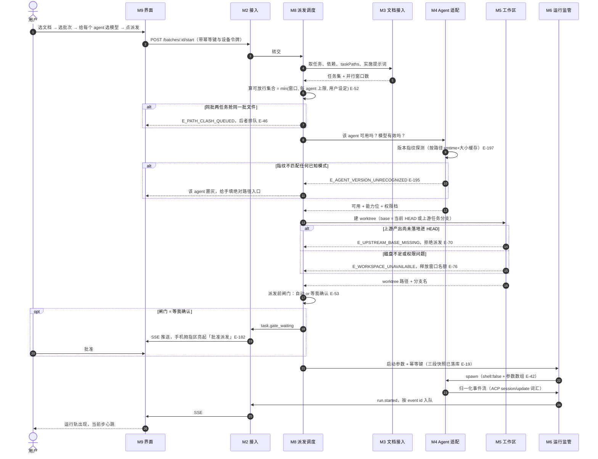
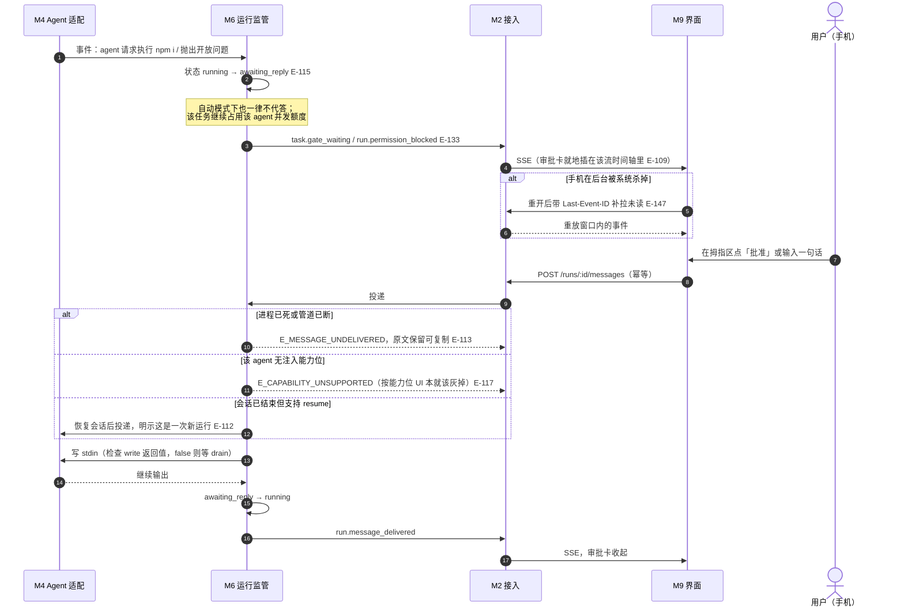
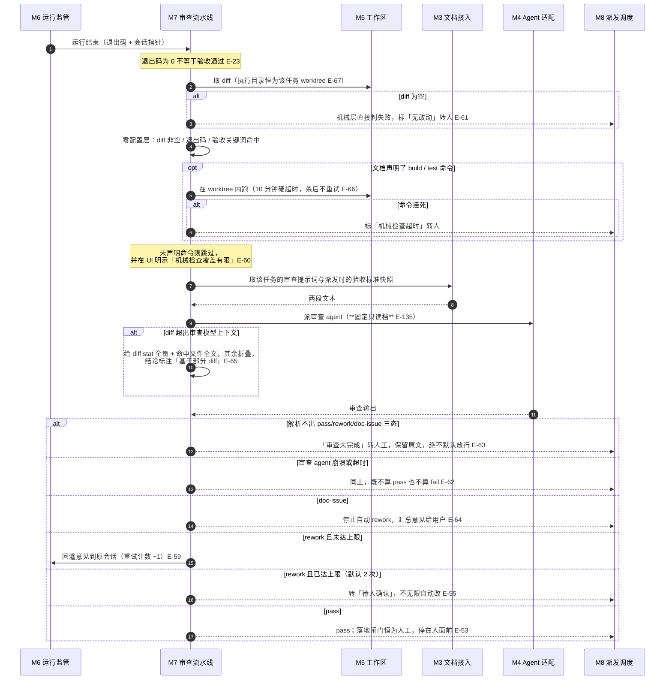
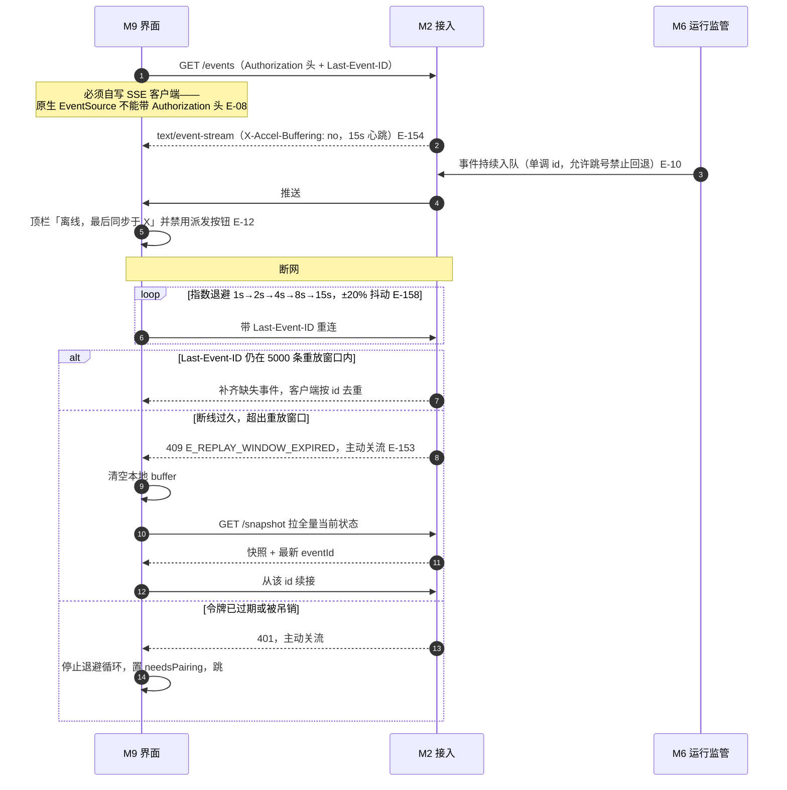

# UX

## 关键流程

四条主流程，每条都走到失败分支为止——**只画顺利路径的时序图价值减半**。
图里的参与方一律用模块 ID，步骤上标边界编号；在阅读器里两者都可点开。

### 流程一：按批次派发一个任务

### 流程二：agent 中途提问，人从手机回话

这条流程是「自动派活」能不能真的自动的关键——
中档权限必然会在装依赖处停下（E-134），没有回话通路则整条链停摆。

### 流程三：审查流水线（两级）

### 流程四：手机断线重连与重放窗口过期

## 交互反馈

| 场景 | 反馈形态 |
|---|---|
| **加载中** | 首屏用骨架屏；**运行流绝不用 spinner 代表整轮运行**——九个状态各有字形（11 节 avoid#6） |
| **成功** | 不弹 toast。状态由运行轨与徽标承载，**颜色是第三层信息** |
| **失败** | 三种形态各有唯一落点（见 07 节）：字段错在输入框下、业务错就地 inline、整页失败只有两种 |
| **空态** | **不是插画**，是「选文档 → 选批次 → 选模型 → 派发」四步引导，当前步高亮、已完成步显示所选值可点回改（E-108） |
| **首次使用** | 同上；另有一次性横幅说明「阅读器里那套手工三态已被本调度器接管」（E-84） |
| **停止** | **一帧内本地置 stopped 并写明死在第几步**，不等回包；服务端事件到达即清 intent，失败则横幅回滚（11 节 avoid#11 + E-157） |
| **离线** | 顶栏持久条「已断开，最后更新 hh:mm」，停止按钮置灰并说明原因，恢复后自动补齐（E-12、E-112） |
| **等待人回话** | 审批卡就地插在该流时间轴，全局只用一个未处理计数徽标；**绝不弹全局模态打断其他还在跑的流**（E-109） |
| **疑似停滞** | 显示「已 N 分钟无新输出」的静默计时，而不是让用户自己猜（E-22）；仍在输出时只标弱提示（E-120） |

## 文案原则

- **步骤标签必须是「工具 + 对象」**：写「读取 `orders.csv`（2,481 行）」，
  不许写「工具调用」「处理中」（11 节 avoid#15、#16）
- **不拟人化**：没有「让我想想…」「正在努力中」。步骤标签是日志行
- **不假精确**：没有「准确率 98.7%」「提效 60%」。这是一个以可审计为前提的页面，编了就崩
- **错误文案说清原因与改法**：「模型 `o4-mini` 不在 codex 配置里，选一个或手填」，
  而不是「模型无效」
- **审批文案如实**：手机上批准派发前闸门，文案必须写「批准派发」，
  **不得含糊成「同意」**——否则用户不知道自己刚刚启动了一次运行（E-182）
- **中文用户文案只在前端** `src/i18n/`；daemon 的英文 message 只出现在可展开的「技术详情」里
- **数据缺失显示「—」，不拿 0 冒充**（E-26）

## 无障碍基线

- **状态区分不能只靠色相**——每个状态必须同时有形状与文字。
  两问必须都是「能」：删掉字形还能区分吗？放灰度还能区分吗？（E-110、E-172）
- 形状由 `lib/spine-shape.ts` 的**内联 SVG path** 承载而非 Unicode 字符（决策 46）——
  Android WebView 的中文回退字体不保证有 `⬡` / `▤` / `⌁` 的字形，
  缺字形会显示成豆腐块，而那正是不能只靠颜色时的唯一替代信息
- **键盘可达**：所有交互控件可 Tab 到达；`focus-visible` 用
  `box-shadow: 0 0 0 3px var(--needs-soft)`，**永不 `outline:none` 而不给替代**
- 运行流条目的键盘焦点用**内嵌环**，不能用会撑开布局的 outline（否则滚动列表整体抖）
- **对比度**：深浅两套 token 各自独立核算并由 `check-contrast.ts` 机检（决策 30）；
  正文与次要文字均 ≥4.5:1，已在 11 节逐项标注实测值
- **焦点顺序**跟随视觉顺序：左栏 → 顶栏闸门开关 → 流甲板（按栏从左到右）→ 栏内时间轴
- 审批卡出现时**焦点移到卡内首个动作**，关闭后焦点回到触发它的那条流
- `prefers-reduced-motion` 下心跳环冻结、流式文本改为整块追加；
  **耗时计数器仍在走**，所以「是不是卡死了」依然有答案
- 跟随系统主题与字号，**禁止锁根字号、禁止 `text-size-adjust:none`、禁止 zoom**（E-15）
- 手机端触摸目标 ≥44×44px，停止与批准分置两端或间距 ≥24px（E-107、E-124）

## 感知性能目标

这些是**目标**，不是承诺——15 节说明了哪些数没有实测依据。

| 指标 | 目标 | 依据 |
|---|---|---|
| 首屏可交互 | < 1.5s（局域网，冷缓存） | 产物本地托管、无 CDN、主 chunk 只含三个首屏页 |
| 事件到达 → 屏幕更新 | < 120ms | flush 按帧合并，最小间隔 80ms（E-144） |
| 切换到某条流的历史片段 | < 300ms | 按字节偏移分段读，单段 ≤2000 行（E-98） |
| 十万行日志的滚动 | 不掉帧 | 虚拟列表只挂载可视窗口，**任何时候不把全量放进 DOM 或 store**（E-143） |
| 手机首屏加载会话 | 尾部 32 KB | 不预取全量，切后台回前台不重拉（E-99） |
| 停止按钮的视觉反馈 | 一帧内 | 本地乐观置态，不等回包（E-157） |
