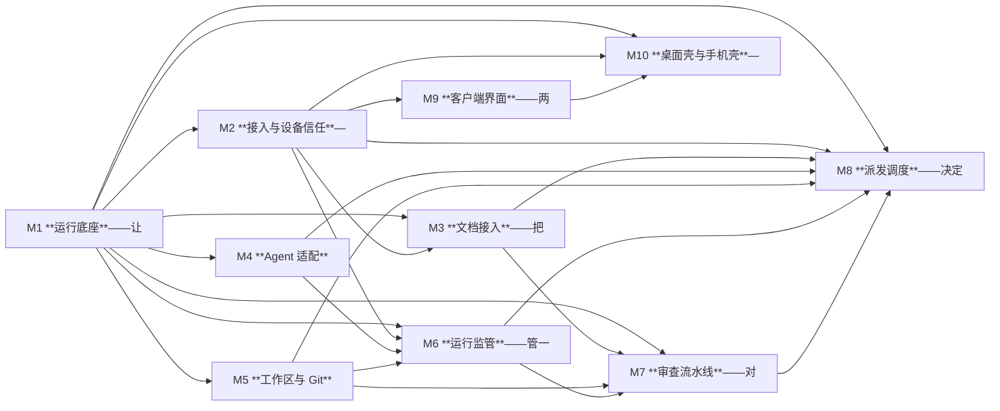

# Agent任务调度器　项目知识库

> 这是本项目的入口。**任何人或模型要动这个项目，从这一页开始。**

## 查东西去哪

| 你想知道 | 去哪 |
|---|---|
| 项目干什么、不干什么 | [[01-概述与目标]]、[[02-非目标]] |
| 用什么技术、否掉过什么 | [[05-技术栈]] |
| 某个模块负责什么、代码在哪 | `图谱/模块/<模块ID>.md` |
| 某个任务怎么做、做完没有 | `图谱/任务/<任务ID>.md` |
| 某种异常该怎么处理 | `图谱/边界/<边界ID>.md` |
| 代码怎么摆、分几层 | [[07-前端架构]]、[[08-后端架构]] |
| 接口长什么样 | [[10-接口约定]] |
| 界面该长什么样 | [[11-UI]]、[[12-UX]] |
| 为什么这么设计 | [[22-决策记录]] |
| 有什么风险没解决 | [[21-风险与未决事项]] |

## 规模

10 个模块 · 77 个任务 · 121.5 人天 · 271 条边界（99% 被任务覆盖）

## 模块地图

## 模块

- [[M1]]　**运行底座**——让 daemon 在这台机器上稳定跑起来并把字节落到磁盘上：进程单实例与端口、启动自检、开机自启注册、数据目录、结构化存储的连接与迁移、日志正文的追加写与字节偏移索引、以及全部平台差异（进程树终止、路径规范化与长路径、配置目录、子进程编码）的唯一收口。凡与操作系统、磁盘、进程存活打交道而不带任何业务概念的都归它　· 9 任务 · 14.5 人天
- [[M10]]　**桌面壳与手机壳**——只做窗口与单实例、系统通知、令牌安全存储三件事的两个原生容器，外加 daemon 未运行时的引导、Windows/macOS/Linux 桌面构建与运行依赖检测。壳按界面声明的可选桥接接口去实现，界面在没有壳时按能力探测降级，因此依赖方向恒为壳→界面　· 5 任务 · 9 人天
- [[M2]]　**接入与设备信任**——定义两端如何连上 daemon 并不丢事件地保持同步：一次性配对码与可单独吊销的设备令牌、鉴权与操作归属、REST 骨架与 API 版本、SSE 服务端的事件信封／重放窗口／保活，以及自写的 SSE 客户端。凡「谁能连上、连上之后按什么协议收发」的都归它　· 6 任务 · 10 人天
- [[M3]]　**文档接入**——把 `docs-data.js` 变成本产品唯一的任务真相源（任务、依赖、批次、并行窗口、验收标准、边界编号、实施与审查两段提示词），并负责内容指纹、派发时快照与文档重出后的三个标记。凡「这条数据来自文档」的都归它　· 5 任务 · 7 人天
- [[M4]]　**Agent 适配**——把形态各异的 agent 抽象成同一个可派发对象：注册表（含每个 agent 通用的版本指纹探测字段与具名的「适配器种类」枚举）、可执行探测、模型清单读取与降级、启动参数与三档权限映射、以各家原生通道为主干把输出归一化成 ACP `session/update` 词汇的事件、可回话与**是否提供流式事件**等能力位，并自实现一个通用 ACP 适配器作为兜底与第 6 家及以后的入口。凡「某一家 agent 跟别家怎么不一样」的都归它　· 12 任务 · 21 人天
- [[M5]]　**工作区与 Git**——为每个任务准备、隔离与回收独立 worktree，从中读出改动（改动文件数、diff stat、diff 正文）并生成只读落地清单。凡要碰 git 或任务工作目录的都归它　· 4 任务 · 4.5 人天
- [[M6]]　**运行监管**——管一次运行从启动到结束的全过程：状态机（「已退出」与「已落地」分开）、收流与落盘编排、按游标分段回读与厂商会话文件的只读引用、进度信号、停滞检测、中止与 daemon 重启后的对账、回话投递。凡「这一次运行现在怎么样、它说过什么」的都归它　· 9 任务 · 13.5 人天
- [[M7]]　**审查流水线**——对已结束的运行做「合不合格」的判定：先跑本地机械检查，通过后以只读档派一个 agent 跑文档给出的审查提示词，产出 pass / rework / doc-issue 并回灌 rework 意见。凡「判定一次运行的结果」的都归它　· 4 任务 · 5 人天
- [[M8]]　**派发调度**——决定什么时候把哪个任务、用哪个 agent 与哪个模型、以什么权限派出去，并按批次、并行窗口、每 agent 并发与路径冲突限流，在三个闸门处停或放行、失败或重派时重新入队。凡涉及顺序、名额、放行、重派的都归它　· 5 任务 · 8 人天
- [[M9]]　**客户端界面**——两端共用的那一套界面本身：多流监看、会话查看、审批与闸门、设置与配对、落地清单，以及同一套代码的窄屏降级。它只通过 M2 的契约与 daemon 通信，**界面里不含任何业务判定**　· 18 任务 · 29 人天

## 任务（按开工批次）

同一批内互不依赖，可以并行派活；跨批必须等前面落地。

### 第 1 批　1 个 · 1.5 人天　（无前置依赖，可立即开工）
- [[M1-T1]]　仓库骨架、进程入口与启动自检

### 第 2 批　3 个 · 4.5 人天
- [[M1-T2]]　SQLite 连接工厂、四条 PRAGMA 与迁移执行器
- [[M1-T3]]　三平台路径、数据目录与可执行文件解析
- [[M4-T1]]　agent 注册表两层结构与热加载

### 第 3 批　9 个 · 14.5 人天
- [[M1-T4]]　日志正文追加写、字节偏移索引与切片
- [[M1-T9]]　三平台进程树与原生自启适配器
- [[M2-T1]]　REST 骨架、插件链顺序与错误信封
- [[M2-T4]]　事件信封、单调 id 分配器与重放缓冲
- [[M3-T1]]　docs-data.js 解析与内容指纹
- [[M4-T2]]　参数模板校验与模板变量白名单
- [[M4-T5]]　四家模型清单读取与降级
- [[M4-T7]]　三档权限与三档思考强度的抽象与厂商参数映射
- [[M6-T1]]　运行状态机与非法迁移拦截

### 第 4 批　9 个 · 15.5 人天
- [[M1-T5]]　磁盘占用统计、写满兜底与受限删除原语
- [[M1-T6]]　开机自启注册机制与优雅退出对账
- [[M1-T7]]　三平台子进程 spawn 基座与行读取器
- [[M2-T2]]　设备配对、令牌哈希与吊销
- [[M2-T6]]　请求体校验、路由表一致性与契约断言
- [[M3-T2]]　任务、批次与依赖导入
- [[M4-T6]]　模型与思考强度的粒度与透传
- [[M6-T5]]　中止、进程树终止与状态落定
- [[M9-T1]]　Web 骨架、token 层与主题

### 第 5 批　11 个 · 16.5 人天
- [[M1-T8]]　三档超时计时器与背压
- [[M10-T1]]　壳桥接契约与能力探测
- [[M2-T3]]　鉴权中间件与免鉴权白名单
- [[M3-T3]]　派发快照与三个变更标记
- [[M3-T4]]　文档接管横幅与阅读器入口
- [[M4-T3]]　版本指纹探测与可执行路径解析
- [[M5-T1]]　worktree 准备、分支命名与回收
- [[M8-T1]]　并发窗口计算与瓶颈归因
- [[M9-T2]]　形状枚举与状态徽标
- [[M9-T3]]　自写 hash 路由与守卫
- [[M9-T4]]　HTTP 客户端、错误规格化与重试

### 第 6 批　15 个 · 24 人天
- [[M10-T2]]　三平台桌面壳（Tauri v2）
- [[M10-T3]]　手机壳（Capacitor / Android）
- [[M2-T5]]　SSE 服务端：分帧、心跳、重放与断流
- [[M3-T5]]　审查提示词与验收标准的取用接口
- [[M4-T10]]　pi 原生适配器（RPC 模式）
- [[M4-T11]]　grok 原生适配器
- [[M4-T4]]　可用性探测与不可用态
- [[M4-T8]]　codex 原生适配器
- [[M4-T9]]　claude 原生适配器
- [[M5-T2]]　base 选择与上游产出校验
- [[M5-T3]]　diff 读取与改动文件数
- [[M6-T2]]　收流编排与落盘接线
- [[M8-T2]]　路径冲突检测与排队
- [[M9-T14]]　设置页：agent 注册表与模型选择
- [[M9-T15]]　设置页：设备、配对与浏览器模式

### 第 7 批　9 个 · 15 人天
- [[M10-T4]]　两端版本校验与共享打包管线
- [[M4-T12]]　dsh headless 适配器与通用 ACP 扩展槽
- [[M5-T4]]　落地清单与 worktree 处置
- [[M6-T3]]　进度信号与通用字段提取
- [[M6-T6]]　回话投递与能力位约束
- [[M6-T8]]　会话分段回读与厂商会话引用
- [[M7-T1]]　机械检查两层与执行目录
- [[M8-T3]]　批次推进与幂等派发
- [[M9-T5]]　自写 SSE 客户端与重连

### 第 8 批　7 个 · 11 人天
- [[M10-T5]]　三平台 CI、桌面产物与支持清单
- [[M6-T4]]　停滞检测与静默计时
- [[M6-T7]]　自动模式下的提问处置
- [[M6-T9]]　会话保留策略与全文查找
- [[M7-T2]]　审查 agent 派发与 diff 裁剪
- [[M8-T5]]　重派、换 agent 与原样重跑
- [[M9-T6]]　事件缓冲与按帧渲染

### 第 9 批　2 个 · 3 人天
- [[M7-T3]]　三态判定与失败兜底
- [[M9-T7]]　运行轨与运行流条目

### 第 10 批　4 个 · 7 人天
- [[M7-T4]]　rework 回灌与重试上限
- [[M8-T4]]　三个闸门与预设组合
- [[M9-T8]]　虚拟列表与日志窗口
- [[M9-T9]]　多流甲板与密度档

### 第 11 批　5 个 · 7.5 人天
- [[M9-T10]]　审批卡与闸门交互
- [[M9-T11]]　停止的乐观呈现与离线态
- [[M9-T12]]　手机端布局与拇指区
- [[M9-T16]]　空态四步引导、批次汇总与落地清单页
- [[M9-T17]]　流头部参照条与会话序号

### 第 12 批　2 个 · 1.5 人天
- [[M9-T13]]　手机原样重跑入口
- [[M9-T18]]　逐任务指派面板与并发瓶颈说明

### 依赖全景

任务共 77 个，画成一张图会糊。去阅读器 `index.html` 概览页看可点、可高亮关键路径的交互式依赖图。

## 边界

- [[E-01]]　桌面 UI 关闭但任务在跑　→ [[M1-T6]]
- [[E-02]]　daemon 重启后会话失联　→ [[M1-T6]]、[[M6-T5]]
- [[E-03]]　端口被占用或多实例　→ [[M1-T1]]
- [[E-04]]　未开桌面直接从手机派活　→ [[M9-T11]]
- [[E-05]]　批次中途人工干预　→ [[M8-T4]]
- [[E-06]]　同网段但连不上　→ [[M9-T4]]、[[M9-T15]]
- [[E-07]]　配对码泄露或重复使用　→ [[M2-T2]]
- [[E-08]]　daemon 被隧道暴露到公网　→ [[M2-T3]]、[[M9-T5]]
- [[E-09]]　PC 局域网 IP 变化　→ [[M9-T15]]
- [[E-10]]　手机断网期间任务跑完　→ [[M2-T4]]
- [[E-11]]　手机离线推送不可达　→ [[M10-T3]]
- [[E-12]]　壳内 WebView 与 daemon 断连　→ [[M9-T11]]
- [[E-13]]　手机竖屏看批次与并行窗口　→ [[M9-T12]]
- [[E-14]]　两端版本不一致　→ [[M9-T11]]、[[M10-T4]]
- [[E-15]]　深色模式与系统字号放大　→ [[M9-T1]]
- [[E-16]]　docs-data.js 编码读错　→ [[M3-T1]]
- [[E-17]]　用时间戳误判文档变更　→ [[M3-T1]]
- [[E-18]]　任务从文档中消失　→ [[M3-T3]]
- [[E-19]]　验收标准被事后改动　→ [[M3-T3]]、[[M9-T16]]
- [[E-20]]　依赖脏数据　→ [[M3-T2]]
- [[E-21]]　多份文档同时接入　→ [[M3-T2]]
- [[E-22]]　agent 长时间零输出　→ [[M6-T4]]
- [[E-23]]　退出码为 0 但活没干完　→ [[M6-T1]]、[[M7-T1]]
- [[E-24]]　单任务日志膨胀　→ [[M1-T4]]
- [[E-25]]　会话内容含密钥　→ [[M6-T8]]
- [[E-26]]　token 用量字段缺失　→ [[M4-T11]]、[[M6-T3]]
- [[E-27]]　同一任务重试或续跑　→ [[M6-T9]]
- [[E-28]]　DeepSeek Harness 的破坏性变更　→ [[M4-T12]]
- [[E-29]]　agent 没装或版本过老　→ [[M4-T4]]
- [[E-30]]　模型名无权限或已改名　→ [[M4-T6]]
- [[E-31]]　同一 agent 并发多任务　→ [[M5-T2]]、[[M9-T17]]、[[M9-T18]]
- [[E-32]]　桌面端会话不共享　→ [[M6-T8]]
- [[E-33]]　设了覆盖模型的任务重试　→ [[M4-T6]]
- [[E-34]]　任务切换执行 agent　→ [[M4-T6]]
- [[E-35]]　从未设过默认模型　→ [[M4-T6]]
- [[E-36]]　模型名在派发时已失效　→ [[M4-T3]]、[[M8-T5]]
- [[E-37]]　环境变量与命令行参数冲突　→ [[M4-T9]]、[[M6-T3]]、[[M9-T17]]
- [[E-38]]　列模型命令超时或失败　→ [[M4-T5]]、[[M9-T14]]
- [[E-39]]　列模型输出格式变化　→ [[M4-T5]]
- [[E-40]]　agent 未安装或不在 PATH　→ [[M4-T4]]
- [[E-41]]　模型清单最终为空　→ [[M4-T6]]
- [[E-42]]　模型名含 shell 元字符　→ [[M1-T7]]、[[M4-T6]]
- [[E-43]]　配置文件缺失或损坏　→ [[M4-T5]]
- [[E-44]]　用户在别处切换了模型　→ [[M4-T5]]
- [[E-45]]　别名与完整模型 ID 并存　→ [[M4-T6]]
- [[E-46]]　同批任务抢同一批文件　→ [[M8-T2]]
- [[E-47]]　单 agent 并发满但窗口有空位　→ [[M8-T1]]、[[M9-T18]]
- [[E-48]]　窗口数为 1 或依赖纯串行　→ [[M8-T1]]
- [[E-49]]　批内某任务失败或审查未过　→ [[M8-T3]]
- [[E-50]]　批次执行途中文档变了　→ [[M3-T5]]、[[M8-T3]]
- [[E-51]]　daemon 重启或断电恢复　→ [[M8-T3]]
- [[E-52]]　并发瓶颈来源不明　→ [[M8-T1]]、[[M9-T18]]
- [[E-53]]　落地闸门在本版不可用　→ [[M8-T4]]
- [[E-54]]　闸门等确认而人长时间不来　→ [[M8-T4]]
- [[E-55]]　全自动下审查反复判 rework　→ [[M7-T4]]
- [[E-56]]　执行中途改闸门开关　→ [[M8-T4]]
- [[E-57]]　两端同时点确认　→ [[M8-T4]]
- [[E-58]]　手机曾退到后台　→ [[M9-T12]]
- [[E-59]]　用户点「打回」　→ [[M7-T4]]
- [[E-60]]　机械检查覆盖有限　→ [[M7-T1]]
- [[E-61]]　退出码 0 但没有改动　→ [[M7-T1]]
- [[E-62]]　审查 agent 崩溃或超时　→ [[M7-T3]]
- [[E-63]]　审查输出不合三态　→ [[M7-T3]]
- [[E-64]]　审查判 doc-issue　→ [[M7-T3]]
- [[E-65]]　diff 超出审查模型上下文　→ [[M7-T2]]
- [[E-66]]　build/test 命令挂死　→ [[M7-T1]]
- [[E-67]]　机械检查跑错目录　→ [[M7-T1]]
- [[E-68]]　rework 后改动反而回退　→ [[M7-T4]]
- [[E-69]]　目标目录不是 git 仓库　→ [[M5-T1]]
- [[E-70]]　下游 base 缺上游产出　→ [[M5-T2]]
- [[E-71]]　分支名冲突　→ [[M5-T1]]
- [[E-72]]　主工作区有未提交改动　→ [[M5-T1]]、[[M5-T3]]
- [[E-73]]　任务结束后 worktree 处置　→ [[M5-T4]]
- [[E-74]]　用户要落地　→ [[M5-T4]]、[[M9-T16]]
- [[E-75]]　agent 自己动了远端　→ [[M5-T3]]
- [[E-76]]　worktree 创建失败　→ [[M5-T1]]
- [[E-77]]　任务从文档消失但仍在跑　→ [[M3-T3]]
- [[E-78]]　验收标准在验收前变了　→ [[M3-T3]]
- [[E-79]]　文件变了但内容没变　→ [[M3-T1]]
- [[E-80]]　同任务重派多轮　→ [[M3-T3]]
- [[E-81]]　文档在派发瞬间被重新生成　→ [[M3-T3]]
- [[E-82]]　文档源不可读　→ [[M3-T1]]
- [[E-83]]　用户仍去点交接台的手工三态　→ [[M3-T4]]
- [[E-84]]　首次接管某文档　→ [[M3-T4]]
- [[E-85]]　打开原文档阅读器　→ [[M3-T4]]
- [[E-86]]　文档目录被移动或重命名　→ [[M3-T4]]
- [[E-87]]　同时接管多份文档　→ [[M3-T2]]
- [[E-88]]　可执行路径无效　→ [[M4-T4]]、[[M9-T14]]
- [[E-89]]　参数模板写错　→ [[M4-T2]]
- [[E-90]]　模型解析器失效　→ [[M4-T5]]
- [[E-91]]　并发上限被设为 0 或负数　→ [[M4-T1]]
- [[E-92]]　升级后内置默认变了　→ [[M4-T1]]、[[M9-T14]]
- [[E-93]]　配置文件被外部手改　→ [[M4-T1]]
- [[E-94]]　配置含未知字段或缺字段　→ [[M4-T1]]
- [[E-95]]　两个 agent 配成同一路径　→ [[M4-T2]]
- [[E-96]]　厂商会话文件的所有权　→ [[M6-T8]]
- [[E-97]]　厂商会话文件已不在　→ [[M6-T8]]
- [[E-98]]　单会话体积超阈值　→ [[M6-T8]]、[[M9-T8]]
- [[E-99]]　手机端打开大会话　→ [[M9-T12]]
- [[E-100]]　运行中日志持续追加　→ [[M9-T8]]
- [[E-101]]　日志含终端控制序列　→ [[M9-T8]]
- [[E-102]]　单行超长　→ [[M9-T8]]
- [[E-103]]　磁盘占用达告警阈值　→ [[M1-T5]]
- [[E-104]]　存储盘写满　→ [[M1-T5]]
- [[E-105]]　自动清理被触发　→ [[M6-T9]]
- [[E-106]]　桌面端多流并置　→ [[M9-T9]]
- [[E-107]]　手机小屏看运行流　→ [[M9-T12]]
- [[E-108]]　零运行空态　→ [[M9-T16]]、[[M9-T18]]
- [[E-109]]　半自动命中审批点　→ [[M9-T10]]
- [[E-110]]　长时间盯屏与色觉差异　→ [[M9-T2]]、[[M9-T7]]、[[M9-T16]]
- [[E-111]]　一次派发涉及一整批　→ [[M9-T16]]
- [[E-112]]　会话已结束后才回话　→ [[M6-T6]]
- [[E-113]]　消息投递失败　→ [[M6-T6]]
- [[E-114]]　两端同时回话　→ [[M6-T6]]
- [[E-115]]　自动模式下 agent 提问　→ [[M6-T7]]
- [[E-116]]　空消息或超长消息　→ [[M6-T6]]
- [[E-117]]　agent 不具备注入能力　→ [[M6-T6]]
- [[E-118]]　中止时已有改动　→ [[M6-T5]]
- [[E-119]]　三平台进程树残留　→ [[M1-T7]]、[[M1-T9]]、[[M6-T5]]
- [[E-120]]　长思考被误判停滞　→ [[M1-T8]]、[[M6-T4]]
- [[E-121]]　换 agent 重派　→ [[M8-T5]]
- [[E-122]]　等人回话期间超时　→ [[M6-T4]]
- [[E-123]]　daemon 重启后的孤儿记录　→ [[M1-T6]]、[[M6-T1]]
- [[E-124]]　手机端误触中止　→ [[M9-T12]]
- [[E-125]]　配对多台设备　→ [[M9-T15]]
- [[E-126]]　两台设备同时派发同一任务　→ [[M8-T3]]、[[M9-T4]]
- [[E-127]]　设备丢失或令牌泄露　→ [[M2-T2]]、[[M9-T15]]
- [[E-128]]　操作归属不明　→ [[M2-T3]]
- [[E-129]]　路径含空格、Unicode、元字符或 Windows 长路径　→ [[M1-T3]]
- [[E-130]]　agent 入口不是原生二进制　→ [[M1-T7]]
- [[E-131]]　编码与换行错乱　→ [[M1-T7]]
- [[E-132]]　平台分支散落各处　→ [[M1-T9]]
- [[E-133]]　沙箱拦下越界写入　→ [[M6-T7]]
- [[E-134]]　agent 要联网装依赖　→ [[M6-T7]]
- [[E-135]]　审查 agent 的权限　→ [[M4-T7]]、[[M7-T2]]
- [[E-136]]　某 agent 被调到最高档　→ [[M4-T7]]、[[M9-T17]]
- [[E-137]]　各家权限参数语义不一　→ [[M4-T7]]
- [[E-138]]　高档位下 agent 自行推远端　→ [[M1-T7]]
- [[E-139]]　Node 版本过低　→ [[M1-T1]]
- [[E-140]]　流里混入非 JSON 行　→ [[M1-T7]]
- [[E-141]]　单行超长撑爆缓冲　→ [[M1-T7]]
- [[E-142]]　daemon 长跑内存增长　→ [[M1-T8]]、[[M6-T2]]、[[M9-T6]]
- [[E-143]]　超长日志的渲染　→ [[M9-T6]]、[[M9-T8]]
- [[E-144]]　事件洪峰　→ [[M9-T6]]
- [[E-145]]　极窄屏布局　→ [[M9-T12]]
- [[E-146]]　桌面壳启动时 daemon 未运行　→ [[M10-T2]]
- [[E-147]]　手机 app 被系统杀后重开　→ [[M10-T3]]
- [[E-148]]　缺少 WebView2 运行时　→ [[M10-T2]]
- [[E-149]]　单次运行日志过大　→ [[M1-T4]]
- [[E-150]]　两个 daemon 抢同一个库　→ [[M1-T2]]
- [[E-151]]　日志文件被手工删除　→ [[M1-T4]]
- [[E-152]]　原生模块 ABI 不匹配　→ [[M1-T2]]
- [[E-153]]　断线超过重放窗口　→ [[M2-T4]]、[[M2-T5]]、[[M9-T5]]
- [[E-154]]　反代缓冲导致流不实时　→ [[M2-T5]]、[[M9-T5]]
- [[E-155]]　两端同时在线　→ [[M2-T5]]
- [[E-156]]　令牌过期而流仍开着　→ [[M2-T5]]、[[M9-T5]]
- [[E-157]]　写操作与事件流打架　→ [[M9-T11]]
- [[E-158]]　SSE 重连风暴　→ [[M9-T5]]
- [[E-159]]　方向可能被推翻　→ [[M9-T1]]
- [[E-160]]　用户不看真页或直接认可　→ [[M9-T1]]
- [[E-161]]　用户看图后否决方向　→ [[M9-T1]]
- [[E-162]]　文档自证为伪证据　→ [[M9-T1]]
- [[E-163]]　少量运行流　→ [[M9-T9]]
- [[E-164]]　多运行流排布　→ [[M9-T9]]
- [[E-165]]　紧凑档展开某条流　→ [[M9-T9]]
- [[E-166]]　紧凑档宽度不够　→ [[M9-T9]]
- [[E-167]]　视野外的流转成「要你」　→ [[M9-T9]]
- [[E-168]]　桌面窗口被拖窄　→ [[M9-T9]]
- [[E-169]]　浅色对比度不达标　→ [[M9-T1]]
- [[E-170]]　组件里写死颜色　→ [[M9-T1]]
- [[E-171]]　「无色 = 不用管」在浅底　→ [[M9-T1]]
- [[E-172]]　形状依赖深色发光　→ [[M9-T2]]
- [[E-173]]　浅色欠账重新滋生　→ [[M9-T1]]
- [[E-174]]　字体加载失败　→ [[M10-T4]]
- [[E-175]]　无外网环境　→ [[M10-T4]]
- [[E-176]]　字体体积　→ [[M10-T4]]
- [[E-177]]　手机重跑撞上已在跑　→ [[M8-T5]]、[[M9-T13]]
- [[E-178]]　重跑时原 agent 不在线　→ [[M8-T5]]
- [[E-179]]　批次错位重跑　→ [[M8-T5]]
- [[E-180]]　拿旧快照盲跑　→ [[M8-T5]]
- [[E-181]]　早上多条失败　→ [[M9-T13]]
- [[E-182]]　审批文案含糊　→ [[M9-T10]]
- [[E-183]]　字母组撞车　→ [[M9-T14]]
- [[E-184]]　窄处的身份识别　→ [[M9-T14]]
- [[E-185]]　接入新 agent 的视觉成本　→ [[M9-T14]]
- [[E-186]]　原生通道破坏性变更　→ [[M4-T8]]
- [[E-187]]　接入第 5/6 个 agent　→ [[M4-T12]]
- [[E-188]]　ACP v1 没有会话列举　→ [[M4-T12]]
- [[E-189]]　一个 agent 两种适配器都可用　→ [[M4-T12]]
- [[E-190]]　ACP 适配器冷启动慢　→ [[M1-T8]]
- [[E-191]]　dsh 冒烟任务未通过　→ [[M4-T12]]
- [[E-192]]　dsh 启动失败或非 0 退出　→ [[M4-T12]]
- [[E-193]]　注册表有 dsh 项但本机未装　→ [[M4-T12]]
- [[E-194]]　dsh 版本超出已知区间　→ [[M4-T12]]
- [[E-195]]　探测输出无法识别　→ [[M2-T1]]、[[M4-T3]]
- [[E-196]]　PATH 上有多个同名可执行　→ [[M4-T3]]
- [[E-197]]　探测开销　→ [[M4-T3]]
- [[E-198]]　例行升级导致版本串微变　→ [[M4-T3]]
- [[E-199]]　用户手填了绝对路径　→ [[M4-T3]]
- [[E-200]]　壳模块受阻而界面已就绪　→ [[M10-T1]]、[[M10-T3]]
- [[E-201]]　pi 指向了别的可执行　→ [[M4-T4]]
- [[E-202]]　pi 大版本升级改了 RPC 命令集　→ [[M4-T9]]、[[M4-T10]]
- [[E-203]]　pi 的 RPC 行读取　→ [[M1-T7]]、[[M4-T10]]
- [[E-204]]　要清的文件正被读　→ [[M1-T5]]
- [[E-205]]　磁盘写满时谁来删　→ [[M1-T5]]
- [[E-206]]　清理候选集越界　→ [[M1-T5]]
- [[E-207]]　正文在产品外被删　→ [[M6-T9]]
- [[E-208]]　用户关掉了系统自启项　→ [[M10-T2]]
- [[E-209]]　升级后自启项指向旧路径　→ [[M1-T3]]、[[M1-T6]]、[[M1-T9]]、[[M10-T2]]、[[M10-T5]]
- [[E-210]]　注册被系统拒绝　→ [[M1-T6]]、[[M10-T2]]
- [[E-211]]　手机壳没有自启这回事　→ [[M10-T3]]
- [[E-212]]　完全不装壳直接起 daemon　→ [[M1-T6]]
- [[E-213]]　未 await 的 Promise 静默失败　→ [[M1-T1]]
- [[E-214]]　Windows 上的换行抖动　→ [[M1-T1]]
- [[E-215]]　加字段只改了类型　→ [[M2-T6]]
- [[E-216]]　加字段只改了 schema　→ [[M2-T6]]
- [[E-217]]　客户端发来多余字段　→ [[M2-T6]]
- [[E-218]]　浏览器 Ctrl+F 搜不全　→ [[M9-T16]]
- [[E-219]]　全文搜索阻塞 daemon　→ [[M6-T9]]
- [[E-220]]　边搜边写　→ [[M6-T9]]
- [[E-221]]　搜索目标已被清理　→ [[M6-T9]]
- [[E-222]]　命中未登记的 hash　→ [[M9-T3]]
- [[E-223]]　路径参数指向不存在的对象　→ [[M9-T3]]
- [[E-224]]　壳内首次加载 hash 为空　→ [[M9-T3]]
- [[E-225]]　Android 硬件返回键　→ [[M10-T3]]
- [[E-226]]　**全新装机的自举困境**　→ [[M2-T2]]
- [[E-227]]　先浏览器后装壳　→ [[M9-T15]]
- [[E-228]]　同一浏览器开第二个标签　→ [[M9-T15]]
- [[E-229]]　浏览器模式的能力缺失　→ [[M9-T15]]
- [[E-230]]　有状态没有专属字形　→ [[M9-T2]]、[[M9-T7]]
- [[E-231]]　SVG 里写死颜色　→ [[M9-T2]]
- [[E-232]]　非整数 DPR 下形状糊　→ [[M9-T2]]
- [[E-233]]　屏幕阅读器与灰度打印　→ [[M9-T2]]
- [[E-234]]　新增状态没配形状　→ [[M9-T2]]
- [[E-235]]　档位分支散落各处　→ [[M9-T9]]
- [[E-236]]　某一档漏掉停止键　→ [[M9-T9]]
- [[E-237]]　窄窗下想省空间　→ [[M9-T9]]
- [[E-238]]　拖动窗口打断状态　→ [[M9-T9]]
- [[E-239]]　按 UA 猜设备　→ [[M9-T9]]
- [[E-240]]　单栏切换藏住提醒　→ [[M9-T12]]
- [[E-241]]　任务依赖成环　→ [[M3-T2]]
- [[E-242]]　deps 引用了幽灵任务　→ [[M3-T2]]
- [[E-243]]　文档重出导致批次号位移　→ [[M3-T2]]
- [[E-244]]　全部任务无依赖　→ [[M3-T2]]
- [[E-245]]　窗口数设得比机器扛得住的大　→ [[M8-T1]]
- [[E-246]]　上游日后导出了 batchNo　→ [[M3-T1]]
- [[E-247]]　阅读器里那条键根本不存在　→ [[M3-T1]]
- [[E-248]]　两边窗口数不一致　→ [[M9-T14]]
- [[E-249]]　阅读器与调度器同时开着　→ [[M3-T4]]
- [[E-250]]　桌面 GUI 日后开放了外部接口　→ **没有任务兜底**
- [[E-251]]　「codex 与 CLI 共用 daemon」被证伪　→ **没有任务兜底**
- [[E-252]]　读者只看 04 节不看附录　→ **没有任务兜底**
- [[E-253]]　dsh 全程无流式事件　→ [[M4-T12]]、[[M6-T3]]
- [[E-254]]　agent 不支持思考强度　→ [[M4-T6]]、[[M4-T7]]、[[M9-T17]]
- [[E-255]]　思考强度档位无效或超出该模型取值域　→ [[M4-T6]]
- [[E-256]]　自报思考强度与所选不一致　→ [[M4-T7]]、[[M9-T17]]
- [[E-257]]　平台支持只完成一半　→ [[M10-T2]]、[[M10-T5]]
- [[E-258]]　Linux 缺少桌面运行依赖　→ [[M10-T2]]、[[M10-T5]]
- [[E-259]]　CPU 架构没有发布资产　→ [[M10-T5]]
- [[E-260]]　上游收紧系统版本下限　→ [[M10-T5]]
- [[E-261]]　Linux 没有 systemd 用户实例　→ [[M1-T6]]
- [[E-262]]　POSIX 可执行文件没有执行权限　→ [[M1-T3]]、[[M4-T4]]
- [[E-263]]　符号链接目标无效　→ [[M1-T3]]、[[M4-T4]]
- [[E-264]]　配置保存了另一平台的路径格式　→ [[M1-T3]]、[[M4-T3]]
- [[E-265]]　三平台矩阵任一失败　→ [[M10-T5]]
- [[E-266]]　CI 无法执行完整 GUI 测试　→ [[M10-T5]]
- [[E-267]]　macOS 产物未签名或未公证　→ [[M10-T5]]
- [[E-268]]　Linux 只在 Ubuntu 验证　→ [[M10-T5]]
- [[E-269]]　自启集成测试留下真实注册项　→ [[M1-T9]]
- [[E-270]]　图形界面或自启进程找不到 shell 中已安装的 agent　→ [[M1-T3]]、[[M1-T7]]、[[M4-T3]]
- [[E-271]]　平台数据目录输入缺失或不是绝对路径　→ [[M1-T3]]

## 章节目录

**概览**
[[01-概述与目标]]　[[02-非目标]]　[[03-术语表]]

**约束**
[[04-开发条件]]　[[05-技术栈]]

**设计**
[[06-系统架构与模块划分]]　[[07-前端架构]]　[[08-后端架构]]　[[09-数据模型]]　[[10-接口约定]]　[[11-UI]]　[[12-UX]]

**质量**
[[13-边界问题与异常处理]]　[[14-安全与权限]]　[[15-性能与容量假设]]　[[16-可观测性]]　[[17-测试策略]]

**执行**
[[18-部署与运维]]　[[19-模块任务拆分]]　[[20-里程碑与交付顺序]]　[[21-风险与未决事项]]

**附录**
[[22-决策记录]]　[[23-变更记录]]　[[24-参考资料]]

---

_`图谱/` 下的笔记由 `build_vault.py` 从 24 节的表格派生。改这些笔记的正文没用，下次重跑会被覆盖——要改内容请改对应章节的表格，再重跑脚本。只有「代码位置」「实施沉淀」「验证记录」这几段是受保护的，重跑不动它们。_
