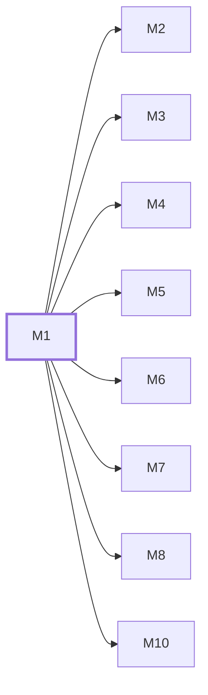

# M1　**运行底座**——让 daemon 在这台机器上稳定跑起来并把字节落到磁盘上：进程单实例与端口、启动自检、开机自启注册、数据目录、结构化存储的连接与迁移、日志正文的追加写与字节偏移索引、以及全部平台差异（进程树终止、路径规范化与长路径、配置目录、子进程编码）的唯一收口。凡与操作系统、磁盘、进程存活打交道而不带任何业务概念的都归它

## 依赖关系

- 本模块依赖：无，可最先开工
- 被依赖：[[M2]]、[[M3]]、[[M4]]、[[M5]]、[[M6]]、[[M7]]、[[M8]]、[[M10]]

## 下辖任务（8 个 · 12.5 人天）

| 任务 | 标题 | 预估 | 覆盖边界 |
|---|---|---|---|
| [[M1-T1]] | 仓库骨架、进程入口与启动自检 | 1.5d | [[E-03]]、[[E-139]]、[[E-213]]、[[E-214]] |
| [[M1-T2]] | SQLite 连接工厂、四条 PRAGMA 与迁移执行器 | 1d | [[E-150]]、[[E-152]] |
| [[M1-T3]] | platform 模块：进程树终止、路径与 cmd 引用 | 1.5d | [[E-119]]、[[E-129]]、[[E-132]] |
| [[M1-T4]] | 日志正文追加写、字节偏移索引与切片 | 2d | [[E-149]]、[[E-151]]、[[E-24]] |
| [[M1-T5]] | 磁盘占用统计、写满兜底与受限删除原语 | 1.5d | [[E-103]]、[[E-104]]、[[E-204]]、[[E-205]]、[[E-206]] |
| [[M1-T6]] | 开机自启注册机制与优雅退出对账 | 1.5d | [[E-01]]、[[E-02]]、[[E-123]]、[[E-210]]、[[E-212]] |
| [[M1-T7]] | 子进程 spawn 基座与行读取器 | 2d | [[E-130]]、[[E-131]]、[[E-138]]、[[E-140]]、[[E-141]]、[[E-203]]、[[E-42]] |
| [[M1-T8]] | 三档超时计时器与背压 | 1.5d | [[E-120]]、[[E-142]]、[[E-190]] |

## 涉及的边界

- [[E-01]]　桌面 UI 关闭但任务在跑
- [[E-02]]　daemon 重启后会话失联
- [[E-03]]　端口被占用或多实例
- [[E-04]]　未开桌面直接从手机派活
- [[E-05]]　批次中途人工干预
- [[E-24]]　单任务日志膨胀
- [[E-42]]　模型名含 shell 元字符
- [[E-103]]　磁盘占用达告警阈值
- [[E-104]]　存储盘写满
- [[E-119]]　Windows 进程树残留
- [[E-120]]　长思考被误判停滞
- [[E-123]]　daemon 重启后的孤儿记录
- [[E-129]]　路径含空格中文或超长
- [[E-130]]　agent 不是 .exe
- [[E-131]]　编码与换行错乱
- [[E-132]]　平台分支散落各处
- [[E-138]]　高档位下 agent 自行推远端
- [[E-139]]　Node 版本过低
- [[E-140]]　流里混入非 JSON 行
- [[E-141]]　单行超长撑爆缓冲
- [[E-142]]　daemon 长跑内存增长
- [[E-149]]　单次运行日志过大
- [[E-150]]　两个 daemon 抢同一个库
- [[E-151]]　日志文件被手工删除
- [[E-152]]　原生模块 ABI 不匹配
- [[E-190]]　ACP 适配器冷启动慢
- [[E-203]]　pi 的 RPC 行读取
- [[E-204]]　要清的文件正被读
- [[E-205]]　磁盘写满时谁来删
- [[E-206]]　清理候选集越界
- [[E-210]]　注册被系统拒绝
- [[E-212]]　完全不装壳直接起 daemon
- [[E-213]]　未 await 的 Promise 静默失败
- [[E-214]]　Windows 上的换行抖动
- [[E-241]]　任务依赖成环
- [[E-242]]　deps 引用了幽灵任务
- [[E-243]]　文档重出导致批次号位移
- [[E-244]]　全部任务无依赖
- [[E-245]]　窗口数设得比机器扛得住的大
- [[E-246]]　上游日后导出了 batchNo
- [[E-247]]　阅读器里那条键根本不存在
- [[E-248]]　两边窗口数不一致
- [[E-249]]　阅读器与调度器同时开着
- [[E-250]]　桌面 GUI 日后开放了外部接口
- [[E-251]]　「codex 与 CLI 共用 daemon」被证伪
- [[E-252]]　读者只看 04 节不看附录

## 代码位置

<!-- code:begin -->
_（实施后回填。一行一处，格式：`路径:行号` — 说明）_
<!-- code:end -->

## 备注

<!-- notes:begin -->
_（本模块的设计取舍、踩过的坑。没有就留空。）_
<!-- notes:end -->
