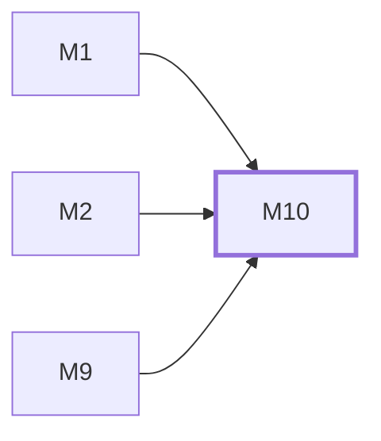

# M10　**桌面壳与手机壳**——只做窗口与单实例、系统通知、令牌安全存储三件事的两个原生容器，外加 daemon 未运行时的引导、Windows/macOS/Linux 桌面构建与运行依赖检测。壳按界面声明的可选桥接接口去实现，界面在没有壳时按能力探测降级，因此依赖方向恒为壳→界面

## 依赖关系

- 本模块依赖：[[M1]]、[[M2]]、[[M9]]
- 被依赖：无，没有模块等它

## 下辖任务（5 个 · 9 人天）

| 任务 | 标题 | 预估 | 覆盖边界 |
|---|---|---|---|
| [[M10-T1]] | 壳桥接契约与能力探测 | 1.5d | [[E-200]] |
| [[M10-T2]] | 三平台桌面壳（Tauri v2） | 2d | [[E-146]]、[[E-148]]、[[E-208]]、[[E-209]]、[[E-210]]、[[E-257]]、[[E-258]] |
| [[M10-T3]] | 手机壳（Capacitor / Android） | 2d | [[E-11]]、[[E-147]]、[[E-200]]、[[E-211]]、[[E-225]] |
| [[M10-T4]] | 两端版本校验与共享打包管线 | 1.5d | [[E-14]]、[[E-174]]、[[E-175]]、[[E-176]] |
| [[M10-T5]] | 三平台 CI、桌面产物与支持清单 | 2d | [[E-209]]、[[E-257]]、[[E-258]]、[[E-259]]、[[E-260]]、[[E-265]]、[[E-266]]、[[E-267]]、[[E-268]] |

## 涉及的边界

- [[E-11]]　手机离线推送不可达
- [[E-14]]　两端版本不一致
- [[E-146]]　桌面壳启动时 daemon 未运行
- [[E-147]]　手机 app 被系统杀后重开
- [[E-148]]　缺少 WebView2 运行时
- [[E-174]]　字体加载失败
- [[E-175]]　无外网环境
- [[E-176]]　字体体积
- [[E-200]]　壳模块受阻而界面已就绪
- [[E-208]]　用户关掉了系统自启项
- [[E-209]]　升级后自启项指向旧路径
- [[E-210]]　注册被系统拒绝
- [[E-211]]　手机壳没有自启这回事
- [[E-225]]　Android 硬件返回键
- [[E-257]]　平台支持只完成一半
- [[E-258]]　Linux 缺少桌面运行依赖
- [[E-259]]　CPU 架构没有发布资产
- [[E-260]]　上游收紧系统版本下限
- [[E-265]]　三平台矩阵任一失败
- [[E-266]]　CI 无法执行完整 GUI 测试
- [[E-267]]　macOS 产物未签名或未公证
- [[E-268]]　Linux 只在 Ubuntu 验证

## 代码位置

<!-- code:begin -->
_（实施后回填。一行一处，格式：`路径:行号` — 说明）_
<!-- code:end -->

## 备注

<!-- notes:begin -->
_（本模块的设计取舍、踩过的坑。没有就留空。）_
<!-- notes:end -->
