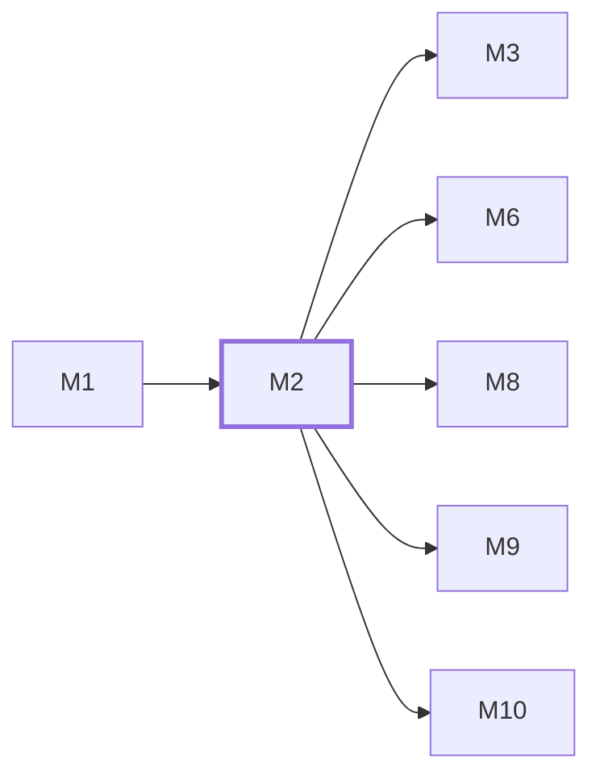

# M2　**接入与设备信任**——定义两端如何连上 daemon 并不丢事件地保持同步：一次性配对码与可单独吊销的设备令牌、鉴权与操作归属、REST 骨架与 API 版本、SSE 服务端的事件信封／重放窗口／保活，以及自写的 SSE 客户端。凡「谁能连上、连上之后按什么协议收发」的都归它

## 依赖关系

- 本模块依赖：[[M1]]
- 被依赖：[[M3]]、[[M6]]、[[M8]]、[[M9]]、[[M10]]

## 下辖任务（6 个 · 10 人天）

| 任务 | 标题 | 预估 | 覆盖边界 |
|---|---|---|---|
| [[M2-T1]] | REST 骨架、插件链顺序与错误信封 | 1.5d | [[E-195]] |
| [[M2-T2]] | 设备配对、令牌哈希与吊销 | 2d | [[E-07]]、[[E-127]]、[[E-226]] |
| [[M2-T3]] | 鉴权中间件与免鉴权白名单 | 1.5d | [[E-08]]、[[E-128]] |
| [[M2-T4]] | 事件信封、单调 id 分配器与重放缓冲 | 1.5d | [[E-10]]、[[E-153]] |
| [[M2-T5]] | SSE 服务端：分帧、心跳、重放与断流 | 2d | [[E-153]]、[[E-154]]、[[E-155]]、[[E-156]] |
| [[M2-T6]] | 请求体校验、路由表一致性与契约断言 | 1.5d | [[E-215]]、[[E-216]]、[[E-217]] |

## 涉及的边界

- [[E-06]]　同网段但连不上
- [[E-07]]　配对码泄露或重复使用
- [[E-08]]　daemon 被隧道暴露到公网
- [[E-09]]　PC 局域网 IP 变化
- [[E-10]]　手机断网期间任务跑完
- [[E-25]]　会话内容含密钥
- [[E-57]]　两端同时点确认
- [[E-125]]　配对多台设备
- [[E-126]]　两台设备同时派发同一任务
- [[E-127]]　设备丢失或令牌泄露
- [[E-128]]　操作归属不明
- [[E-153]]　断线超过重放窗口
- [[E-154]]　反代缓冲导致流不实时
- [[E-155]]　两端同时在线
- [[E-156]]　令牌过期而流仍开着
- [[E-195]]　探测输出无法识别
- [[E-215]]　加字段只改了类型
- [[E-216]]　加字段只改了 schema
- [[E-217]]　客户端发来多余字段
- [[E-226]]　**全新装机的自举困境**

## 代码位置

<!-- code:begin -->
_（实施后回填。一行一处，格式：`路径:行号` — 说明）_
<!-- code:end -->

## 备注

<!-- notes:begin -->
_（本模块的设计取舍、踩过的坑。没有就留空。）_
<!-- notes:end -->
