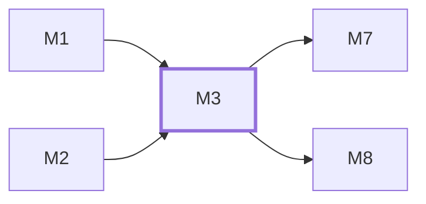

# M3　**文档接入**——把 `docs-data.js` 变成本产品唯一的任务真相源（任务、依赖、批次、并行窗口、验收标准、边界编号、实施与审查两段提示词），并负责内容指纹、派发时快照与文档重出后的三个标记。凡「这条数据来自文档」的都归它

## 依赖关系

- 本模块依赖：[[M1]]、[[M2]]
- 被依赖：[[M7]]、[[M8]]

## 下辖任务（5 个 · 7 人天）

| 任务 | 标题 | 预估 | 覆盖边界 |
|---|---|---|---|
| [[M3-T1]] | docs-data.js 解析与内容指纹 | 1.5d | [[E-16]]、[[E-17]]、[[E-246]]、[[E-247]]、[[E-79]]、[[E-82]] |
| [[M3-T2]] | 任务、批次与依赖导入 | 1.5d | [[E-17]]、[[E-20]]、[[E-21]]、[[E-241]]、[[E-242]]、[[E-243]]、[[E-244]]、[[E-82]]、[[E-87]] |
| [[M3-T3]] | 派发快照与三个变更标记 | 2d | [[E-18]]、[[E-19]]、[[E-77]]、[[E-78]]、[[E-80]]、[[E-81]] |
| [[M3-T4]] | 文档接管横幅与阅读器入口 | 1d | [[E-249]]、[[E-83]]、[[E-84]]、[[E-85]]、[[E-86]] |
| [[M3-T5]] | 审查提示词与验收标准的取用接口 | 1d | [[E-50]] |

## 涉及的边界

- [[E-16]]　docs-data.js 编码读错
- [[E-17]]　漏判或误判文档变更
- [[E-18]]　任务从文档中消失
- [[E-19]]　验收标准被事后改动
- [[E-20]]　依赖脏数据
- [[E-21]]　多份文档同时接入
- [[E-50]]　批次执行途中文档变了
- [[E-77]]　任务从文档消失但仍在跑
- [[E-78]]　验收标准在验收前变了
- [[E-79]]　文件变了但任务契约没变
- [[E-80]]　同任务重派多轮
- [[E-81]]　文档在派发瞬间被重新生成
- [[E-82]]　文档源不可读或任务包不可派发
- [[E-83]]　用户仍去点交接台的手工三态
- [[E-84]]　首次接管某文档
- [[E-85]]　打开原文档阅读器
- [[E-86]]　文档目录被移动或重命名
- [[E-87]]　同时接管多份文档
- [[E-241]]　任务依赖成环
- [[E-242]]　deps 引用了幽灵任务
- [[E-243]]　文档重出导致批次号位移
- [[E-244]]　全部任务无依赖
- [[E-246]]　上游日后导出了 batchNo
- [[E-247]]　阅读器里那条键根本不存在
- [[E-249]]　阅读器与调度器同时开着

## 代码位置

<!-- code:begin -->
_（实施后回填。一行一处，格式：`路径:行号` — 说明）_
<!-- code:end -->

## 备注

<!-- notes:begin -->
_（本模块的设计取舍、踩过的坑。没有就留空。）_
<!-- notes:end -->
