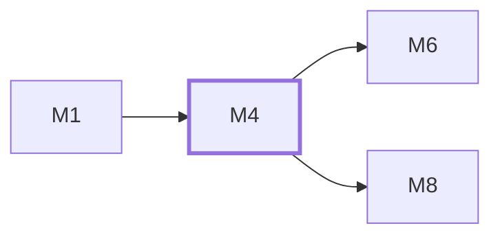

# M4　**Agent 适配**——把形态各异的 agent 抽象成同一个可派发对象：注册表（含每个 agent 通用的版本指纹探测字段与具名的「适配器种类」枚举）、可执行探测、模型清单读取与降级、启动参数与三档权限映射、以各家原生通道为主干把输出归一化成 ACP `session/update` 词汇的事件、可回话与**是否提供流式事件**等能力位，并自实现一个通用 ACP 适配器作为兜底与第 6 家及以后的入口。凡「某一家 agent 跟别家怎么不一样」的都归它；登录态探测（三值、只跑 agent 自己的状态命令、结果缓存）与模型清单的四级来源合并（实时／配置／内置别名／历史）也归它——它们都是「这一家怎么问」的事

## 依赖关系

- 本模块依赖：[[M1]]
- 被依赖：[[M6]]、[[M8]]

## 下辖任务（14 个 · 23 人天）

| 任务 | 标题 | 预估 | 覆盖边界 |
|---|---|---|---|
| [[M4-T1]] | agent 注册表两层结构与热加载 | 2d | [[E-91]]、[[E-92]]、[[E-93]]、[[E-94]] |
| [[M4-T10]] | pi 原生适配器（RPC 模式） | 2d | [[E-202]]、[[E-203]] |
| [[M4-T11]] | grok 原生适配器 | 1.5d | [[E-26]] |
| [[M4-T12]] | dsh headless 适配器与通用 ACP 扩展槽 | 2d | [[E-187]]、[[E-188]]、[[E-189]]、[[E-191]]、[[E-192]]、[[E-193]]、[[E-194]]、[[E-253]]、[[E-28]] |
| [[M4-T13]] | 登录态探测与刷新 | 1d | [[E-335]]、[[E-336]]、[[E-337]]、[[E-346]]、[[E-349]]、[[E-353]]、[[E-354]]、[[E-355]] |
| [[M4-T14]] | 实时清单来源、来源标注与思考强度取值域 | 1d | [[E-255]]、[[E-338]]、[[E-339]]、[[E-340]]、[[E-342]]、[[E-345]]、[[E-350]]、[[E-351]]、[[E-358]]、[[E-38]] |
| [[M4-T2]] | 参数模板校验与模板变量白名单 | 1d | [[E-89]]、[[E-95]] |
| [[M4-T3]] | 版本指纹探测与可执行路径解析 | 2d | [[E-195]]、[[E-196]]、[[E-197]]、[[E-198]]、[[E-199]]、[[E-264]]、[[E-270]]、[[E-36]] |
| [[M4-T4]] | 可用性探测与不可用态 | 1d | [[E-201]]、[[E-262]]、[[E-263]]、[[E-29]]、[[E-40]]、[[E-88]] |
| [[M4-T5]] | 四家模型清单读取与降级 | 2d | [[E-38]]、[[E-39]]、[[E-43]]、[[E-44]]、[[E-90]] |
| [[M4-T6]] | 模型与思考强度的粒度与透传 | 2d | [[E-254]]、[[E-255]]、[[E-30]]、[[E-33]]、[[E-34]]、[[E-35]]、[[E-41]]、[[E-42]]、[[E-45]] |
| [[M4-T7]] | 三档权限与三档思考强度的抽象与厂商参数映射 | 1.5d | [[E-135]]、[[E-136]]、[[E-137]]、[[E-254]]、[[E-256]] |
| [[M4-T8]] | codex 原生适配器 | 2d | [[E-186]] |
| [[M4-T9]] | claude 原生适配器 | 2d | [[E-202]]、[[E-37]] |

## 涉及的边界

- [[E-26]]　token 用量字段缺失
- [[E-28]]　DeepSeek Harness 的破坏性变更
- [[E-29]]　agent 没装或版本过老
- [[E-30]]　模型名无权限或已改名
- [[E-31]]　同一 agent 并发多任务
- [[E-32]]　桌面端会话不共享
- [[E-33]]　设了覆盖模型的任务重试
- [[E-34]]　任务切换执行 agent
- [[E-35]]　从未设过默认模型
- [[E-36]]　模型名在派发时已失效
- [[E-37]]　环境变量与命令行参数冲突
- [[E-38]]　列模型命令超时或失败
- [[E-39]]　列模型输出格式变化
- [[E-40]]　agent 未安装或不在 PATH
- [[E-41]]　模型清单最终为空
- [[E-42]]　模型名含 shell 元字符
- [[E-43]]　配置文件缺失或损坏
- [[E-44]]　用户在别处切换了模型
- [[E-45]]　别名与完整模型 ID 并存
- [[E-88]]　可执行路径无效
- [[E-89]]　参数模板写错
- [[E-90]]　模型解析器失效
- [[E-91]]　并发上限被设为 0 或负数
- [[E-92]]　升级后内置默认变了
- [[E-93]]　配置文件被外部手改
- [[E-94]]　配置含未知字段或缺字段
- [[E-95]]　两个 agent 配成同一路径
- [[E-133]]　沙箱拦下越界写入
- [[E-134]]　agent 要联网装依赖
- [[E-135]]　审查 agent 的权限
- [[E-136]]　某 agent 被调到最高档
- [[E-137]]　各家权限参数语义不一
- [[E-186]]　原生通道破坏性变更
- [[E-187]]　接入第 5/6 个 agent
- [[E-188]]　ACP v1 没有会话列举
- [[E-189]]　一个 agent 两种适配器都可用
- [[E-190]]　ACP 适配器冷启动慢
- [[E-191]]　dsh 冒烟任务未通过
- [[E-192]]　dsh 启动失败或非 0 退出
- [[E-193]]　注册表有 dsh 项但本机未装
- [[E-194]]　dsh 版本超出已知区间
- [[E-195]]　探测输出无法识别
- [[E-196]]　PATH 上有多个同名可执行
- [[E-197]]　探测开销
- [[E-198]]　例行升级导致版本串微变
- [[E-199]]　用户手填了绝对路径
- [[E-201]]　pi 指向了别的可执行
- [[E-202]]　pi 大版本升级改了 RPC 命令集
- [[E-203]]　pi 的 RPC 行读取
- [[E-253]]　dsh 全程无流式事件
- [[E-254]]　agent 不支持思考强度
- [[E-255]]　思考强度档位无效或超出该模型取值域
- [[E-256]]　自报思考强度与所选不一致
- [[E-262]]　POSIX 可执行文件没有执行权限
- [[E-263]]　符号链接目标无效
- [[E-264]]　配置保存了另一平台的路径格式
- [[E-270]]　图形界面或自启进程找不到 shell 中已安装的 agent
- [[E-335]]　登录态探测超时、命令不存在或输出无法解析
- [[E-336]]　agent 判定为 `logged_out` 时派发
- [[E-337]]　claude `loggedIn:false` 但 API key 或网关可用
- [[E-338]]　`live` 成功但清单不含配置当前值
- [[E-339]]　刷新期间与并发刷新
- [[E-340]]　history 来源的取值
- [[E-342]]　覆盖 agent 与实施 agent 不同家
- [[E-345]]　codex app-server 不可用、握手失败或超时
- [[E-346]]　厂商改了列模型或登录状态命令的输出格式
- [[E-349]]　pi 的登录态按 provider
- [[E-350]]　清单同名去重、别名与「当前配置」的位次
- [[E-351]]　思考强度出现厂商原值
- [[E-353]]　登录态探测不读凭据
- [[E-354]]　探测与清单命令的输出落日志
- [[E-355]]　登录命令提示为空、探测时间过旧
- [[E-358]]　设置页的分层值、覆盖与清除

## 代码位置

<!-- code:begin -->
_（实施后回填。一行一处，格式：`路径:行号` — 说明）_
<!-- code:end -->

## 备注

<!-- notes:begin -->
_（本模块的设计取舍、踩过的坑。没有就留空。）_
<!-- notes:end -->
