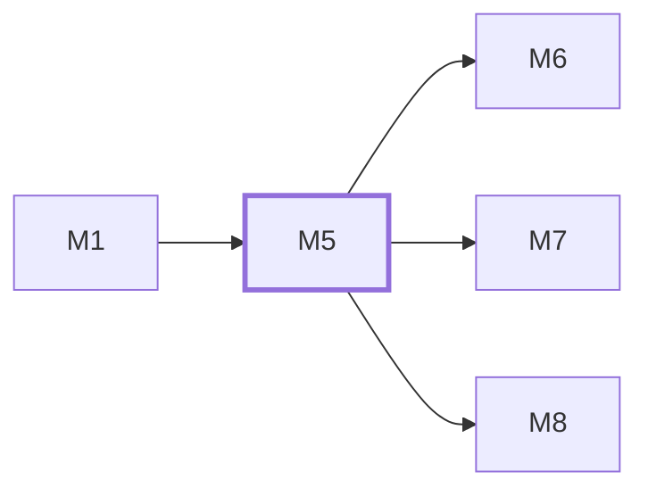

# M5　**工作区与 Git**——为每个任务准备、隔离与回收独立 worktree，从中读出改动（改动文件数、diff stat、diff 正文）并生成只读落地清单。凡要碰 git 或任务工作目录的都归它

## 依赖关系

- 本模块依赖：[[M1]]
- 被依赖：[[M6]]、[[M7]]、[[M8]]

## 下辖任务（4 个 · 4.5 人天）

| 任务 | 标题 | 预估 | 覆盖边界 |
|---|---|---|---|
| [[M5-T1]] | worktree 准备、分支命名与回收 | 1.5d | [[E-69]]、[[E-71]]、[[E-72]]、[[E-76]] |
| [[M5-T2]] | base 选择与上游产出校验 | 1d | [[E-31]]、[[E-70]] |
| [[M5-T3]] | diff 读取与改动文件数 | 1d | [[E-72]]、[[E-75]] |
| [[M5-T4]] | 落地清单与 worktree 处置 | 1d | [[E-73]]、[[E-74]] |

## 涉及的边界

- [[E-31]]　同一 agent 并发多任务
- [[E-69]]　目标目录不是 git 仓库
- [[E-70]]　下游 base 缺上游产出
- [[E-71]]　分支名冲突
- [[E-72]]　主工作区有未提交改动
- [[E-73]]　任务结束后 worktree 处置
- [[E-74]]　用户要落地
- [[E-75]]　agent 自己动了远端
- [[E-76]]　worktree 创建失败

## 代码位置

<!-- code:begin -->
`packages/daemon/src/workspace/worktree.ts:182` — resolveGitExecutable：git 可执行文件经 platform.resolveExecutable() 按宿主解析，或消费注入的 ResolvedExecutable；解析失败抛类型化 AppError，源码无固定绝对路径（E-130）
`packages/daemon/src/workspace/worktree.ts:218` — createDefaultGitRunner：git 调用经 proc/spawnManaged 单一出口，file/argsPrefix 取自解析结果，runId 只取注入的 ids.newId()
`packages/daemon/src/workspace/worktree.ts:276` — checkGitRepository：检测目标目录是否为合法 git 仓库，非 git 仓库标记 requiresSerialExecution: true 阻止静默并行（E-69）
`packages/daemon/src/workspace/worktree.ts:315` — assertGitRepository：非 git 仓库抛出 E_NOT_A_GIT_REPO 并携带 forcedSerial: true，强制单任务串行执行（E-69）
`packages/daemon/src/workspace/worktree.ts:377` — resolveBranchName：聚合本地 refs 与所有活跃 worktree 占用分支，冲突时循环加序号后缀（如 -2），绝不覆盖复用（E-71）
`packages/daemon/src/workspace/worktree.ts:427` — categorizeWorktreeCreationError：识别 ENOSPC 磁盘满与 EACCES 权限问题，映射为 E_WORKSPACE_UNAVAILABLE 并标记 releaseSlot: true（E-76）
`packages/daemon/src/workspace/worktree.ts:464` — prepareWorktree：为任务准备独立隔离 worktree，直接经由 git worktree add 创建，绝不 stash 或修改主工作区未提交改动（E-71, E-72）
`packages/daemon/src/workspace/worktree.ts:555` — removeWorktree：回收并清理 worktree 目录，支持强制清理与关联分支删除，并运行 git worktree prune（E-73）
`packages/daemon/src/workspace/worktree.ts:617` — inspectWorktree：检查 worktree 内部改动状态与 HEAD 相对 diff，提供通用工作区审查与中止前检查契约（E-72）
`packages/daemon/src/workspace/worktree.ts:653` — createWorktreeManager：封装 GitRunner 与依赖注入工厂，实现 WorktreeInspector 统一工作区调度契约
<!-- code:end -->

## 备注

<!-- notes:begin -->
_（本模块的设计取舍、踩过的坑。没有就留空。）_
<!-- notes:end -->
