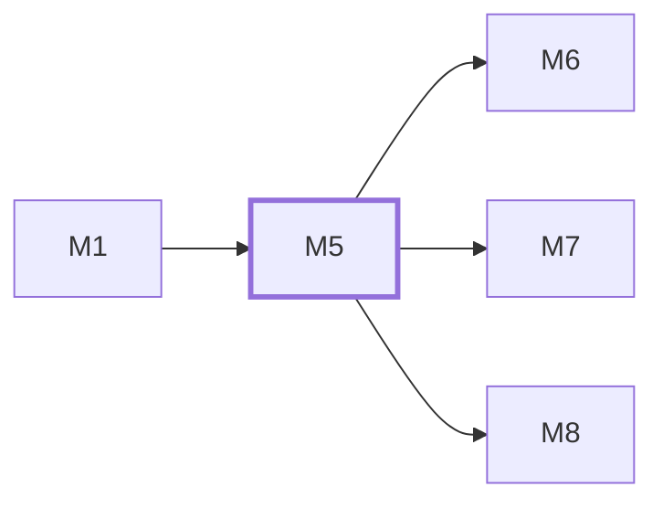

# M5　**工作区与 Git**——为每个任务准备、隔离与回收独立 worktree，从中读出改动（改动文件数、diff stat、diff 正文）并生成只读落地清单。凡要碰 git 或任务工作目录的都归它

## 依赖关系

- 本模块依赖：[[M1]]
- 被依赖：[[M6]]、[[M7]]、[[M8]]

## 下辖任务（4 个 · 4.5 人天）

| 任务 | 标题 | 预估 | 覆盖边界 |
|---|---|---|---|
| [[M5-T1]] | worktree 准备、分支命名与回收 | 1.5d | [[E-69]]、[[E-71]]、[[E-72]]、[[E-76]] |
| [[M5-T2]] | base 选择与上游产出校验 | 1d | [[E-31]]、[[E-70]] |
| [[M5-T3]] | diff 读取与改动文件数 | 1d | [[E-72]]、[[E-75]] |
| [[M5-T4]] | 落地清单与 worktree 处置 | 1d | [[E-73]]、[[E-74]] |

## 涉及的边界

- [[E-31]]　同一 agent 并发多任务
- [[E-69]]　目标目录不是 git 仓库
- [[E-70]]　下游 base 缺上游产出
- [[E-71]]　分支名冲突
- [[E-72]]　主工作区有未提交改动
- [[E-73]]　任务结束后 worktree 处置
- [[E-74]]　用户要落地
- [[E-75]]　agent 自己动了远端
- [[E-76]]　worktree 创建失败

## 代码位置

<!-- code:begin -->
_（实施后回填。一行一处，格式：`路径:行号` — 说明）_
<!-- code:end -->

## 备注

<!-- notes:begin -->
_（本模块的设计取舍、踩过的坑。没有就留空。）_
<!-- notes:end -->
