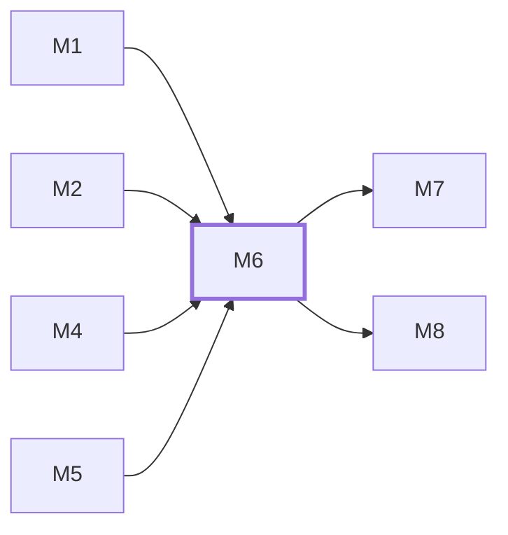

# M6　**运行监管**——管一次运行从启动到结束的全过程：状态机（「已退出」与「已落地」分开）、收流与落盘编排、按游标分段回读与厂商会话文件的只读引用、进度信号、停滞检测、中止与 daemon 重启后的对账、回话投递。凡「这一次运行现在怎么样、它说过什么」的都归它

## 依赖关系

- 本模块依赖：[[M1]]、[[M2]]、[[M4]]、[[M5]]
- 被依赖：[[M7]]、[[M8]]

## 下辖任务（9 个 · 13.5 人天）

| 任务 | 标题 | 预估 | 覆盖边界 |
|---|---|---|---|
| [[M6-T1]] | 运行状态机与非法迁移拦截 | 1.5d | [[E-123]]、[[E-23]] |
| [[M6-T2]] | 收流编排与落盘接线 | 1.5d | [[E-142]] |
| [[M6-T3]] | 进度信号与通用字段提取 | 1d | [[E-253]]、[[E-26]]、[[E-37]] |
| [[M6-T4]] | 停滞检测与静默计时 | 1d | [[E-120]]、[[E-122]]、[[E-22]] |
| [[M6-T5]] | 中止、进程树终止与状态落定 | 1.5d | [[E-02]]、[[E-118]]、[[E-119]] |
| [[M6-T6]] | 回话投递与能力位约束 | 2d | [[E-112]]、[[E-113]]、[[E-114]]、[[E-116]]、[[E-117]] |
| [[M6-T7]] | 自动模式下的提问处置 | 1d | [[E-115]]、[[E-133]]、[[E-134]] |
| [[M6-T8]] | 会话分段回读与厂商会话引用 | 2d | [[E-25]]、[[E-32]]、[[E-96]]、[[E-97]]、[[E-98]] |
| [[M6-T9]] | 会话保留策略与全文查找 | 2d | [[E-105]]、[[E-207]]、[[E-219]]、[[E-220]]、[[E-221]]、[[E-27]] |

## 涉及的边界

- [[E-02]]　daemon 重启后会话失联
- [[E-22]]　agent 长时间零输出
- [[E-23]]　退出码为 0 但活没干完
- [[E-25]]　会话内容含密钥
- [[E-26]]　token 用量字段缺失
- [[E-27]]　同一任务重试或续跑
- [[E-32]]　桌面端会话不共享
- [[E-37]]　环境变量与命令行参数冲突
- [[E-96]]　厂商会话文件的所有权
- [[E-97]]　厂商会话文件已不在
- [[E-98]]　单会话体积超阈值
- [[E-105]]　自动清理被触发
- [[E-112]]　会话已结束后才回话
- [[E-113]]　消息投递失败
- [[E-114]]　两端同时回话
- [[E-115]]　自动模式下 agent 提问
- [[E-116]]　空消息或超长消息
- [[E-117]]　agent 不具备注入能力
- [[E-118]]　中止时已有改动
- [[E-119]]　三平台进程树残留
- [[E-120]]　长思考被误判停滞
- [[E-121]]　换 agent 重派
- [[E-122]]　等人回话期间超时
- [[E-123]]　daemon 重启后的孤儿记录
- [[E-124]]　手机端误触中止
- [[E-133]]　沙箱拦下越界写入
- [[E-134]]　agent 要联网装依赖
- [[E-142]]　daemon 长跑内存增长
- [[E-204]]　要清的文件正被读
- [[E-207]]　正文在产品外被删
- [[E-219]]　全文搜索阻塞 daemon
- [[E-220]]　边搜边写
- [[E-221]]　搜索目标已被清理
- [[E-253]]　dsh 全程无流式事件

## 代码位置

<!-- code:begin -->
`packages/daemon/src/domain/run-state-machine.ts:50` — 运行状态机 13 状态迁移白名单与非法迁移拦截（M6-T1，E-123，E-23）。
`packages/daemon/src/domain/run-state-machine.ts:316` — 注入 clock/ids 的状态机工厂与 run.state_changed 伴随事件生成（M6-T1）。
<!-- code:end -->

## 备注

<!-- notes:begin -->
_（本模块的设计取舍、踩过的坑。没有就留空。）_
<!-- notes:end -->
