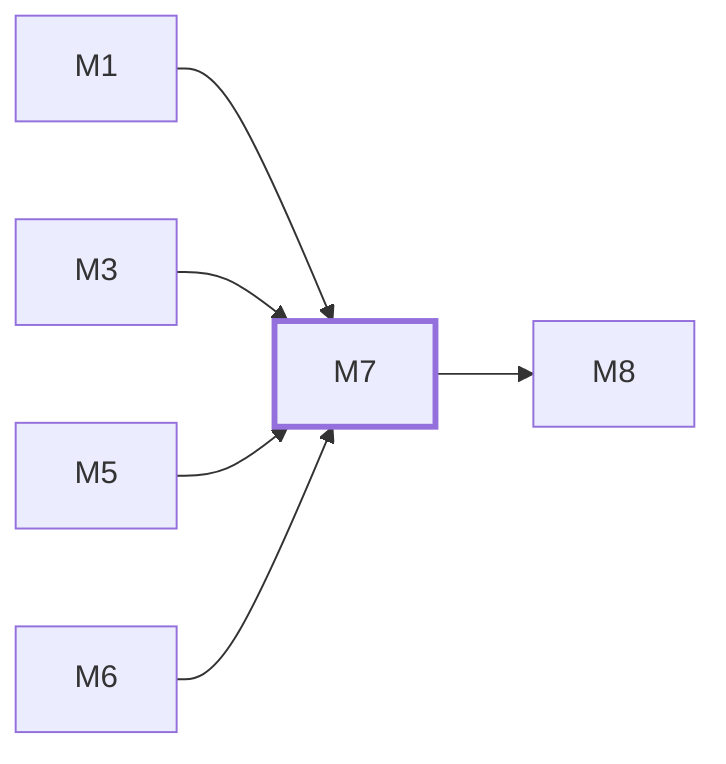

# M7　**审查流水线**——对已结束的运行做「合不合格」的判定：先跑本地机械检查，通过后以只读档派一个 agent 跑文档给出的审查提示词，产出 pass / rework / doc-issue 并回灌 rework 意见；从审查输出提取返工文本、按能力位选回灌／恢复／新开返工运行，以及解析收口运行的八段报告，也归它；第 N+1 轮审查续接同一审查会话、查 bug 阶段的运行与五段报告解析同样归它。凡「判定一次运行的结果」的都归它；审查、查 bug 阶段的运行用哪个 agent、模型与思考强度，一律读派发快照里的任务指派（审查可被 pipeline 设置的「审查覆盖」替换），不自己取 agent 默认

## 依赖关系

- 本模块依赖：[[M1]]、[[M3]]、[[M5]]、[[M6]]
- 被依赖：[[M8]]

## 下辖任务（8 个 · 9.5 人天）

| 任务 | 标题 | 预估 | 覆盖边界 |
|---|---|---|---|
| [[M7-T1]] | 机械检查两层与执行目录 | 1.5d | [[E-23]]、[[E-60]]、[[E-61]]、[[E-66]]、[[E-67]] |
| [[M7-T2]] | 审查 agent 派发与 diff 裁剪 | 1.5d | [[E-135]]、[[E-347]]、[[E-65]] |
| [[M7-T3]] | 三态判定与失败兜底 | 1.5d | [[E-278]]、[[E-62]]、[[E-63]]、[[E-64]] |
| [[M7-T4]] | rework 回灌与重试上限 | 1d | [[E-279]]、[[E-55]]、[[E-59]]、[[E-68]] |
| [[M7-T5]] | 返工承接与新会话派发 | 1d | [[E-112]]、[[E-277]]、[[E-279]]、[[E-55]]、[[E-59]]、[[E-93]] |
| [[M7-T6]] | 收口输出解析与有效裁定 | 1d | [[E-274]]、[[E-286]]、[[E-290]] |
| [[M7-T7]] | 审查续接与轮次上下文 | 1d | [[E-113]]、[[E-302]]、[[E-304]]、[[E-305]]、[[E-307]]、[[E-330]]、[[E-62]] |
| [[M7-T8]] | 查 bug 阶段运行与结果解析 | 1d | [[E-306]]、[[E-307]]、[[E-308]]、[[E-316]]、[[E-320]]、[[E-321]]、[[E-323]]、[[E-328]]、[[E-329]]、[[E-331]]、[[E-341]]、[[E-61]] |

## 涉及的边界

- [[E-23]]　退出码为 0 但活没干完
- [[E-55]]　全自动下审查反复判 rework
- [[E-59]]　用户点「打回」
- [[E-60]]　机械检查覆盖有限
- [[E-61]]　退出码 0 但没有改动
- [[E-62]]　审查 agent 崩溃或超时
- [[E-63]]　审查输出不合三态
- [[E-64]]　审查判 doc-issue
- [[E-65]]　diff 超出审查模型上下文
- [[E-66]]　build/test 命令挂死
- [[E-67]]　机械检查跑错目录
- [[E-68]]　rework 后改动反而回退
- [[E-93]]　配置文件被外部手改
- [[E-112]]　会话已结束后才回话
- [[E-113]]　消息投递失败
- [[E-135]]　审查 agent 的权限
- [[E-274]]　收口输出不合八段
- [[E-277]]　返工需新会话但 worktree 已清理
- [[E-278]]　返工块解析不出 R 条目
- [[E-279]]　无续接能力的 agent 需要返工
- [[E-285]]　收口 agent 上下文超限
- [[E-286]]　收口自报裁定与实际不符
- [[E-290]]　TESTS 失败项无「涉及 〈任务ID〉」
- [[E-294]]　收口运行退出但没改代码
- [[E-302]]　任务终态时会话进程还在
- [[E-304]]　审查会话不能续接或已撑爆
- [[E-305]]　实施会话上下文撑爆
- [[E-306]]　查 bug 开关中途切换
- [[E-307]]　查 bug 修了东西
- [[E-308]]　查 bug 有未修的高危项
- [[E-316]]　查 bug 提示词文档未提供
- [[E-320]]　查 bug 输出不合五段
- [[E-321]]　查 bug 运行没改代码
- [[E-323]]　查 bug 运行本身失败
- [[E-328]]　查 bug 运行的 agent 取值与不可用
- [[E-329]]　查 bug 运行的 git 禁令与 diff 基线
- [[E-330]]　续接撑爆的判定
- [[E-331]]　查 bug 的手动触发与失败重跑
- [[E-341]]　阶段覆盖字段为空、或在非审查阶段出现
- [[E-347]]　同一任务各阶段的模型、思考强度或来源不一致
- [[E-348]]　运行零产出退出
- [[E-352]]　跨家审查覆盖的快照与不可用

## 代码位置

<!-- code:begin -->
_（实施后回填。一行一处，格式：`路径:行号` — 说明）_
<!-- code:end -->

## 备注

<!-- notes:begin -->
_（本模块的设计取舍、踩过的坑。没有就留空。）_
<!-- notes:end -->
