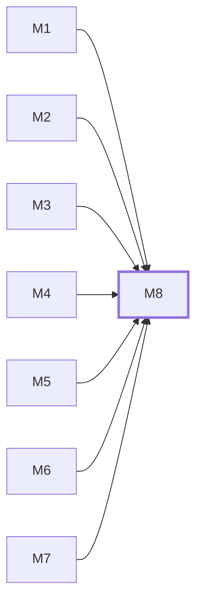

# M8　**派发调度**——决定什么时候把哪个任务、用哪个 agent 与哪个模型、以什么权限派出去，并按批次、并行窗口、每 agent 并发与路径冲突限流，在三个闸门处停或放行、失败或重派时重新入队；判定本批分支是否都进了 HEAD、触发收口运行、按收口报告派修复运行与管理收口轮次也归它；泳道（窗口槽位）分配、任务终态后的补位、查 bug 与收口模式两个开关的持久化同样归它——泳道分配是它算出的派生数据。凡涉及顺序、名额、放行、重派的都归它

## 依赖关系

- 本模块依赖：[[M1]]、[[M2]]、[[M3]]、[[M4]]、[[M5]]、[[M6]]、[[M7]]
- 被依赖：无，没有模块等它

## 下辖任务（8 个 · 13 人天）

| 任务 | 标题 | 预估 | 覆盖边界 |
|---|---|---|---|
| [[M8-T1]] | 并发窗口计算与瓶颈归因 | 1d | [[E-245]]、[[E-47]]、[[E-48]]、[[E-52]] |
| [[M8-T2]] | 路径冲突检测与排队 | 1d | [[E-46]] |
| [[M8-T3]] | 批次推进与幂等派发 | 2d | [[E-126]]、[[E-281]]、[[E-49]]、[[E-50]]、[[E-51]]、[[E-82]] |
| [[M8-T4]] | 三个闸门与预设组合 | 2d | [[E-05]]、[[E-292]]、[[E-53]]、[[E-54]]、[[E-56]]、[[E-57]] |
| [[M8-T5]] | 重派、换 agent 与原样重跑 | 2d | [[E-121]]、[[E-177]]、[[E-178]]、[[E-179]]、[[E-180]]、[[E-36]] |
| [[M8-T6]] | 批次收口触发、轮次与批次级闸门 | 2d | [[E-272]]、[[E-274]]、[[E-283]]、[[E-285]]、[[E-287]]、[[E-288]]、[[E-291]]、[[E-294]]、[[E-295]]、[[E-296]]、[[E-301]] |
| [[M8-T7]] | 收口修复派发、跨批语义与人工撤回 | 1.5d | [[E-275]]、[[E-276]]、[[E-280]]、[[E-290]]、[[E-293]]、[[E-298]]、[[E-300]]、[[E-46]]、[[E-55]] |
| [[M8-T8]] | 流水线槽位、补位与阶段设置 | 1.5d | [[E-283]]、[[E-302]]、[[E-303]]、[[E-307]]、[[E-309]]、[[E-310]]、[[E-311]]、[[E-312]]、[[E-317]]、[[E-318]]、[[E-319]]、[[E-326]]、[[E-327]]、[[E-332]]、[[E-334]] |

## 涉及的边界

- [[E-05]]　批次中途人工干预
- [[E-36]]　模型名在派发时已失效
- [[E-46]]　同批任务抢同一批文件
- [[E-47]]　单 agent 并发满但窗口有空位
- [[E-48]]　窗口数为 1 或依赖纯串行
- [[E-49]]　批内某任务失败或审查未过
- [[E-50]]　批次执行途中文档变了
- [[E-51]]　daemon 重启或断电恢复
- [[E-52]]　并发瓶颈来源不明
- [[E-53]]　落地闸门可设自动
- [[E-54]]　闸门等确认而人长时间不来
- [[E-55]]　全自动下审查反复判 rework
- [[E-56]]　执行中途改闸门开关
- [[E-57]]　两端同时点确认
- [[E-82]]　文档源不可读或任务包不可派发
- [[E-121]]　换 agent 重派
- [[E-126]]　两台设备同时派发同一任务
- [[E-177]]　手机重跑撞上已在跑
- [[E-178]]　重跑时原 agent 不在线
- [[E-179]]　批次错位重跑
- [[E-180]]　拿旧快照盲跑
- [[E-245]]　窗口数设得比机器扛得住的大
- [[E-272]]　全部已验收但分支未进 HEAD
- [[E-274]]　收口输出不合八段
- [[E-275]]　收口发现跨批问题
- [[E-276]]　第 2 轮收口仍 open
- [[E-280]]　修复运行与在途任务抢路径
- [[E-281]]　落地闸门自动但本批收口未跑
- [[E-283]]　收口运行的名额与权限
- [[E-285]]　收口 agent 上下文超限
- [[E-287]]　自动收口的 agent 取值
- [[E-288]]　批次进入 needs_attention 后人的出口
- [[E-290]]　TESTS 失败项无「涉及 〈任务ID〉」
- [[E-291]]　迁移需要整表重建
- [[E-292]]　闸门设置存储缺行或损坏
- [[E-293]]　人工撤回已自动 landed 的任务
- [[E-294]]　收口运行退出但没改代码
- [[E-295]]　收口运行中途失败或被中止
- [[E-296]]　收口提示词匹配不到
- [[E-298]]　任务行的「进 HEAD」标记
- [[E-300]]　同一任务被重复判定要修
- [[E-301]]　进 HEAD 标记的单调性
- [[E-302]]　任务终态时会话进程还在
- [[E-303]]　泳道补位时复用了旧会话引用
- [[E-306]]　查 bug 开关中途切换
- [[E-307]]　查 bug 修了东西
- [[E-309]]　窗口数调小
- [[E-310]]　窗口数调大
- [[E-311]]　一个任务的多个阶段同时在跑
- [[E-312]]　收口模式为手动
- [[E-317]]　泳道分配的算法归属
- [[E-318]]　流水线设置存储缺行或损坏
- [[E-319]]　空闲泳道
- [[E-326]]　任务停在人工闸门期间的泳道与会话
- [[E-327]]　人打回后重新入道
- [[E-332]]　阶段顺序与未知阶段
- [[E-334]]　事件 scope 与过滤

## 代码位置

<!-- code:begin -->
_（实施后回填。一行一处，格式：`路径:行号` — 说明）_
<!-- code:end -->

## 备注

<!-- notes:begin -->
_（本模块的设计取舍、踩过的坑。没有就留空。）_
<!-- notes:end -->
