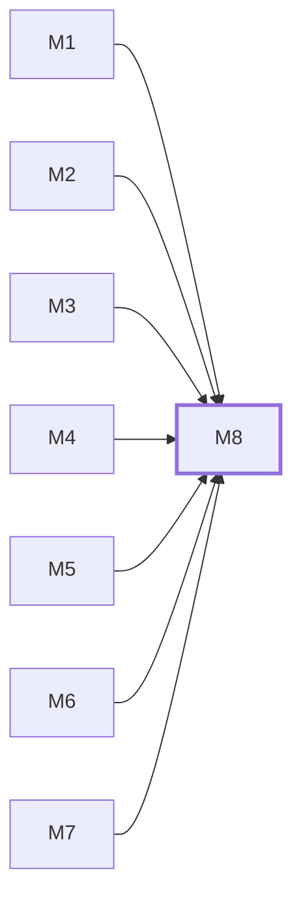

# M8　**派发调度**——决定什么时候把哪个任务、用哪个 agent 与哪个模型、以什么权限派出去，并按批次、并行窗口、每 agent 并发与路径冲突限流，在三个闸门处停或放行、失败或重派时重新入队。凡涉及顺序、名额、放行、重派的都归它

## 依赖关系

- 本模块依赖：[[M1]]、[[M2]]、[[M3]]、[[M4]]、[[M5]]、[[M6]]、[[M7]]
- 被依赖：无，没有模块等它

## 下辖任务（5 个 · 8 人天）

| 任务 | 标题 | 预估 | 覆盖边界 |
|---|---|---|---|
| [[M8-T1]] | 并发窗口计算与瓶颈归因 | 1d | [[E-245]]、[[E-47]]、[[E-48]]、[[E-52]] |
| [[M8-T2]] | 路径冲突检测与排队 | 1d | [[E-46]] |
| [[M8-T3]] | 批次推进与幂等派发 | 2d | [[E-126]]、[[E-49]]、[[E-50]]、[[E-51]]、[[E-82]] |
| [[M8-T4]] | 三个闸门与预设组合 | 2d | [[E-05]]、[[E-53]]、[[E-54]]、[[E-56]]、[[E-57]] |
| [[M8-T5]] | 重派、换 agent 与原样重跑 | 2d | [[E-121]]、[[E-177]]、[[E-178]]、[[E-179]]、[[E-180]]、[[E-36]] |

## 涉及的边界

- [[E-05]]　批次中途人工干预
- [[E-36]]　模型名在派发时已失效
- [[E-46]]　同批任务抢同一批文件
- [[E-47]]　单 agent 并发满但窗口有空位
- [[E-48]]　窗口数为 1 或依赖纯串行
- [[E-49]]　批内某任务失败或审查未过
- [[E-50]]　批次执行途中文档变了
- [[E-51]]　daemon 重启或断电恢复
- [[E-52]]　并发瓶颈来源不明
- [[E-53]]　落地闸门在本版不可用
- [[E-54]]　闸门等确认而人长时间不来
- [[E-55]]　全自动下审查反复判 rework
- [[E-56]]　执行中途改闸门开关
- [[E-57]]　两端同时点确认
- [[E-82]]　文档源不可读或任务包不可派发
- [[E-121]]　换 agent 重派
- [[E-126]]　两台设备同时派发同一任务
- [[E-177]]　手机重跑撞上已在跑
- [[E-178]]　重跑时原 agent 不在线
- [[E-179]]　批次错位重跑
- [[E-180]]　拿旧快照盲跑
- [[E-245]]　窗口数设得比机器扛得住的大

## 代码位置

<!-- code:begin -->
_（实施后回填。一行一处，格式：`路径:行号` — 说明）_
<!-- code:end -->

## 备注

<!-- notes:begin -->
_（本模块的设计取舍、踩过的坑。没有就留空。）_
<!-- notes:end -->
