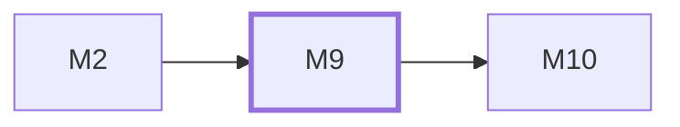

# M9　**客户端界面**——两端共用的那一套界面本身：多流监看、会话查看、审批与闸门、设置与配对、落地清单、按批次折叠的批次树与执行行呼吸灯、按窗口数呈现的任务流水线泳道与「会话已归档」历史行、顶栏两个流水线开关，以及同一套代码的窄屏降级。它只通过 M2 的契约与 daemon 通信，**界面里不含任何业务判定**（折叠默认值、「能否收口」、泳道分配、阶段推进与会话归档都是 daemon 给的字段）；指派面板的分组模型下拉、登录态徽标与刷新按钮、参照条的「来源」段同样只呈现 daemon 下发的字段，不算取值链

## 依赖关系

- 本模块依赖：[[M2]]
- 被依赖：[[M10]]

## 下辖任务（23 个 · 34.5 人天）

| 任务 | 标题 | 预估 | 覆盖边界 |
|---|---|---|---|
| [[M9-T1]] | Web 骨架、token 层与主题 | 2d | [[E-15]]、[[E-159]]、[[E-160]]、[[E-161]]、[[E-162]]、[[E-169]]、[[E-170]]、[[E-171]]、[[E-173]] |
| [[M9-T10]] | 审批卡与闸门交互 | 1.5d | [[E-109]]、[[E-182]] |
| [[M9-T11]] | 停止的乐观呈现与离线态 | 1.5d | [[E-04]]、[[E-12]]、[[E-14]]、[[E-157]] |
| [[M9-T12]] | 手机端布局与拇指区 | 2d | [[E-107]]、[[E-124]]、[[E-13]]、[[E-145]]、[[E-240]]、[[E-58]]、[[E-99]] |
| [[M9-T13]] | 手机原样重跑入口 | 1d | [[E-177]]、[[E-181]] |
| [[M9-T14]] | 设置页：agent 注册表与模型选择 | 2d | [[E-183]]、[[E-184]]、[[E-185]]、[[E-248]]、[[E-38]]、[[E-88]]、[[E-92]]、[[E-95]] |
| [[M9-T15]] | 设置页：设备、配对与浏览器模式 | 2d | [[E-06]]、[[E-09]]、[[E-125]]、[[E-127]]、[[E-227]]、[[E-228]]、[[E-229]] |
| [[M9-T16]] | 空态四步引导、批次汇总与落地清单页 | 2d | [[E-108]]、[[E-110]]、[[E-111]]、[[E-19]]、[[E-218]]、[[E-74]] |
| [[M9-T17]] | 流头部参照条与会话序号 | 0.5d | [[E-136]]、[[E-254]]、[[E-256]]、[[E-31]]、[[E-347]]、[[E-357]]、[[E-37]] |
| [[M9-T18]] | 逐任务指派面板与并发瓶颈说明 | 0.5d | [[E-108]]、[[E-31]]、[[E-47]]、[[E-52]] |
| [[M9-T19]] | 批次树折叠、自动展开与执行呼吸灯 | 1.5d | [[E-13]]、[[E-272]]、[[E-282]]、[[E-284]]、[[E-298]]、[[E-299]] |
| [[M9-T2]] | 形状枚举与状态徽标 | 1.5d | [[E-110]]、[[E-172]]、[[E-230]]、[[E-231]]、[[E-232]]、[[E-233]]、[[E-234]] |
| [[M9-T20]] | 收口泳道、收口报告面板与批次落地清单 | 1d | [[E-106]]、[[E-113]]、[[E-117]]、[[E-157]]、[[E-236]]、[[E-278]]、[[E-286]]、[[E-297]]、[[E-74]] |
| [[M9-T21]] | 任务流水线泳道与历史行 | 2d | [[E-106]]、[[E-166]]、[[E-236]]、[[E-306]]、[[E-307]]、[[E-309]]、[[E-313]]、[[E-314]]、[[E-315]]、[[E-317]]、[[E-319]]、[[E-324]]、[[E-325]]、[[E-326]]、[[E-332]]、[[E-333]] |
| [[M9-T22]] | 顶栏流水线开关与流水线设置页 | 0.5d | [[E-157]]、[[E-26]]、[[E-306]]、[[E-312]]、[[E-318]]、[[E-356]] |
| [[M9-T23]] | 指派面板的登录态、清单来源与刷新 | 0.5d | [[E-254]]、[[E-335]]、[[E-336]]、[[E-338]]、[[E-339]]、[[E-348]]、[[E-350]]、[[E-351]]、[[E-355]]、[[E-356]]、[[E-357]]、[[E-358]]、[[E-359]] |
| [[M9-T3]] | 自写 hash 路由与守卫 | 1.5d | [[E-222]]、[[E-223]]、[[E-224]] |
| [[M9-T4]] | HTTP 客户端、错误规格化与重试 | 1.5d | [[E-06]]、[[E-126]] |
| [[M9-T5]] | 自写 SSE 客户端与重连 | 2d | [[E-08]]、[[E-153]]、[[E-154]]、[[E-156]]、[[E-158]] |
| [[M9-T6]] | 事件缓冲与按帧渲染 | 1.5d | [[E-142]]、[[E-143]]、[[E-144]] |
| [[M9-T7]] | 运行轨与运行流条目 | 2d | [[E-110]]、[[E-230]] |
| [[M9-T8]] | 虚拟列表与日志窗口 | 2d | [[E-100]]、[[E-101]]、[[E-102]]、[[E-143]]、[[E-98]] |
| [[M9-T9]] | 多流甲板与密度档 | 2d | [[E-106]]、[[E-163]]、[[E-164]]、[[E-165]]、[[E-166]]、[[E-167]]、[[E-168]]、[[E-235]]、[[E-236]]、[[E-237]]、[[E-238]]、[[E-239]]、[[E-311]]、[[E-317]] |

## 涉及的边界

- [[E-04]]　未开桌面直接从手机派活
- [[E-06]]　同网段但连不上
- [[E-08]]　daemon 被隧道暴露到公网
- [[E-09]]　PC 局域网 IP 变化
- [[E-12]]　壳内 WebView 与 daemon 断连
- [[E-13]]　手机竖屏看批次与并行窗口
- [[E-14]]　两端版本不一致
- [[E-15]]　深色模式与系统字号放大
- [[E-19]]　验收标准被事后改动
- [[E-26]]　token 用量字段缺失
- [[E-31]]　同一 agent 并发多任务
- [[E-37]]　环境变量与命令行参数冲突
- [[E-38]]　列模型命令超时或失败
- [[E-47]]　单 agent 并发满但窗口有空位
- [[E-52]]　并发瓶颈来源不明
- [[E-53]]　落地闸门可设自动
- [[E-58]]　手机曾退到后台
- [[E-74]]　用户要落地
- [[E-88]]　可执行路径无效
- [[E-92]]　升级后内置默认变了
- [[E-95]]　两个 agent 配成同一路径
- [[E-98]]　单会话体积超阈值
- [[E-99]]　手机端打开大会话
- [[E-100]]　运行中日志持续追加
- [[E-101]]　日志含终端控制序列
- [[E-102]]　单行超长
- [[E-106]]　桌面端多流并置
- [[E-107]]　手机小屏看运行流
- [[E-108]]　零运行空态
- [[E-109]]　半自动命中审批点
- [[E-110]]　长时间盯屏与色觉差异
- [[E-111]]　一次派发涉及一整批
- [[E-113]]　消息投递失败
- [[E-117]]　agent 不具备注入能力
- [[E-124]]　手机端误触中止
- [[E-125]]　配对多台设备
- [[E-126]]　两台设备同时派发同一任务
- [[E-127]]　设备丢失或令牌泄露
- [[E-136]]　某 agent 被调到最高档
- [[E-142]]　daemon 长跑内存增长
- [[E-143]]　超长日志的渲染
- [[E-144]]　事件洪峰
- [[E-145]]　极窄屏布局
- [[E-153]]　断线超过重放窗口
- [[E-154]]　反代缓冲导致流不实时
- [[E-156]]　令牌过期而流仍开着
- [[E-157]]　写操作与事件流打架
- [[E-158]]　SSE 重连风暴
- [[E-159]]　方向可能被推翻
- [[E-160]]　用户不看真页或直接认可
- [[E-161]]　用户看图后否决方向
- [[E-162]]　文档自证为伪证据
- [[E-163]]　少量运行流
- [[E-164]]　多运行流排布
- [[E-165]]　紧凑档展开某条流
- [[E-166]]　紧凑档宽度不够
- [[E-167]]　视野外的流转成「要你」
- [[E-168]]　桌面窗口被拖窄
- [[E-169]]　浅色对比度不达标
- [[E-170]]　组件里写死颜色
- [[E-171]]　「无色 = 不用管」在浅底
- [[E-172]]　形状依赖深色发光
- [[E-173]]　浅色欠账重新滋生
- [[E-174]]　字体加载失败
- [[E-175]]　无外网环境
- [[E-176]]　字体体积
- [[E-177]]　手机重跑撞上已在跑
- [[E-178]]　重跑时原 agent 不在线
- [[E-179]]　批次错位重跑
- [[E-180]]　拿旧快照盲跑
- [[E-181]]　早上多条失败
- [[E-182]]　审批文案含糊
- [[E-183]]　字母组撞车
- [[E-184]]　窄处的身份识别
- [[E-185]]　接入新 agent 的视觉成本
- [[E-200]]　壳模块受阻而界面已就绪
- [[E-218]]　浏览器 Ctrl+F 搜不全
- [[E-222]]　命中未登记的 hash
- [[E-223]]　路径参数指向不存在的对象
- [[E-224]]　壳内首次加载 hash 为空
- [[E-225]]　Android 硬件返回键
- [[E-227]]　先浏览器后装壳
- [[E-228]]　同一浏览器开第二个标签
- [[E-229]]　浏览器模式的能力缺失
- [[E-230]]　有状态没有专属字形
- [[E-231]]　SVG 里写死颜色
- [[E-232]]　非整数 DPR 下形状糊
- [[E-233]]　屏幕阅读器与灰度打印
- [[E-234]]　新增状态没配形状
- [[E-235]]　档位分支散落各处
- [[E-236]]　某一档漏掉停止键
- [[E-237]]　窄窗下想省空间
- [[E-238]]　拖动窗口打断状态
- [[E-239]]　按 UA 猜设备
- [[E-240]]　单栏切换藏住提醒
- [[E-248]]　两边窗口数不一致
- [[E-254]]　agent 不支持思考强度
- [[E-256]]　自报思考强度与所选不一致
- [[E-272]]　全部已验收但分支未进 HEAD
- [[E-278]]　返工块解析不出 R 条目
- [[E-282]]　呼吸灯与运行轨同屏
- [[E-284]]　自动展开只增不减
- [[E-286]]　收口自报裁定与实际不符
- [[E-297]]　收口运行的界面落位
- [[E-298]]　任务行的「进 HEAD」标记
- [[E-299]]　落地闸门开关切到自动
- [[E-306]]　查 bug 开关中途切换
- [[E-307]]　查 bug 修了东西
- [[E-309]]　窗口数调小
- [[E-311]]　一个任务的多个阶段同时在跑
- [[E-312]]　收口模式为手动
- [[E-313]]　点击阶段节点
- [[E-314]]　历史行只读
- [[E-315]]　紧凑档的阶段链
- [[E-317]]　泳道分配的算法归属
- [[E-318]]　流水线设置存储缺行或损坏
- [[E-319]]　空闲泳道
- [[E-324]]　手机端的泳道
- [[E-325]]　历史行的数量与替换
- [[E-326]]　任务停在人工闸门期间的泳道与会话
- [[E-332]]　阶段顺序与未知阶段
- [[E-333]]　泳道数据的取数与缓存
- [[E-335]]　登录态探测超时、命令不存在或输出无法解析
- [[E-336]]　agent 判定为 `logged_out` 时派发
- [[E-338]]　`live` 成功但清单不含配置当前值
- [[E-339]]　刷新期间与并发刷新
- [[E-347]]　同一任务各阶段的模型、思考强度或来源不一致
- [[E-348]]　运行零产出退出
- [[E-350]]　清单同名去重、别名与「当前配置」的位次
- [[E-351]]　思考强度出现厂商原值
- [[E-355]]　登录命令提示为空、探测时间过旧
- [[E-356]]　pipeline 设置四键的写入与校验
- [[E-357]]　参照条「来源」段的取值与缺失
- [[E-358]]　设置页的分层值、覆盖与清除
- [[E-359]]　零产出退出审批卡的三态 stderr 与「换 agent 重派」落点

## 代码位置

<!-- code:begin -->
_（实施后回填。一行一处，格式：`路径:行号` — 说明）_
<!-- code:end -->

## 备注

<!-- notes:begin -->
_（本模块的设计取舍、踩过的坑。没有就留空。）_
<!-- notes:end -->
